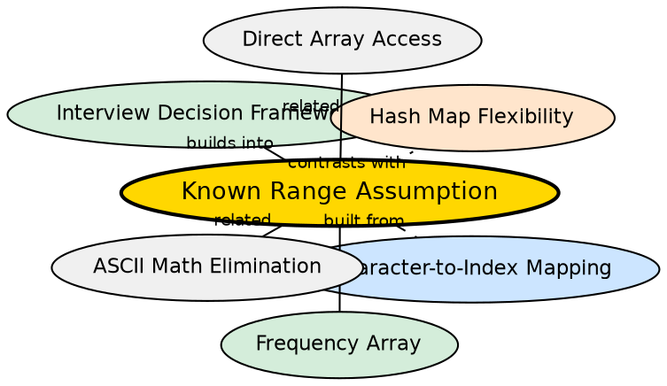

## Formal Definition

The known range assumption states that a frequency array is only viable when the set of possible keys is known, finite, and can be mapped to contiguous integer indices. For character hashing, this means the alphabet must be predetermined (e.g., 'a'–'z', 'A'–'Z', or ASCII 0–127). When this assumption breaks, hash maps become necessary.

## Explanation

A frequency array of size 26 works perfectly for lowercase English letters because there are exactly 26 of them and they are contiguous in ASCII. But the moment you encounter a '#', '1', 'A' (uppercase), or any Unicode character, the array approach fails — either the character doesn't fit in 26 slots, or the mapping `ch - 'a'` produces nonsense. The known range assumption is the invisible precondition that makes frequency arrays work, and its violation is the primary reason to switch to hash maps.

## How It Works

1. Determine the domain: what characters could possibly appear in the input?
2. If the domain is small and contiguous (26 lowercase letters): array works
3. If the domain is small but non-contiguous (e.g., digits + letters): array needs careful mapping
4. If the domain is large or unknown: array is impractical or impossible
5. The assumption is checked at problem analysis time, not at runtime

## Visual Explanation

```dot
digraph known_range {
  rankdir=TB
  node [shape=box style=filled fillcolor="#f0f4ff" fontname="Helvetica"]

  CHECK [label="What characters can appear?" shape=diamond]
  LOW [label="Only a-z\nArray size=26\nDirect mapping"]
  MIXED [label="Mixed case +\npunctuation\nArray impractical" fillcolor="#ffe5cc]
  UNICODE [label="Unicode / unknown\nArray impossible\nUse hash map" fillcolor="#ffe5cc]
  PASS [label="Use freq[26]" fillcolor="#d4edda"]
  FAIL1 [label="Use unordered_map" fillcolor="#d4edda"]

  CHECK -> LOW [label="letters only"]
  CHECK -> MIXED [label="multiple types"]
  CHECK -> UNICODE [label="any character"]
  LOW -> PASS
  MIXED -> FAIL1
  UNICODE -> FAIL1
}
```

## Semantic Network



## Key Properties

- The most commonly violated assumption in coding interviews — candidates use freq[26] without checking the character set
- When violated, the fix is to switch to a hash map (or expand the array to cover the full ASCII range, e.g., int freq[256])
- The assumption is implicit in the problem statement — "given a string of lowercase letters" explicitly guarantees it
- For competitive programming, problems often specify the character set to allow array-based solutions
- Extending the array to int freq[256] covers standard ASCII but not Unicode

## Connections

- Built from: [[character-to-index-mapping|Character-to-Index Mapping]] — mapping is only valid when the range is known
- Builds into: [[frequency-array|Frequency Array]] — arrays depend on this assumption being true
- Builds into: [[interview-decision-framework|Array vs Hash Map Decision Framework]] — this assumption is the deciding factor
- Contrasts with: [[hash-map-flexibility|Hash Map Flexibility]] — hash maps do not require this assumption
- Related: [[ascii-math-elimination|ASCII Math Elimination]] — both are reasons to prefer maps over arrays

## Edge Cases & Gotchas

- "String of lowercase letters" guarantees the assumption — freq[26] is correct
- "String of characters" without qualification does NOT — use a hash map or ask for clarification
- Extended ASCII (128–255) breaks int freq[256] if char is signed (values become negative)
- Unicode characters may be multi-byte in C++ — neither freq[26] nor unordered_map<char,int> handles this correctly; use unordered_map<string,int> for UTF-8 strings
- The assumption can be partially satisfied with a translation table (mapping arbitrary characters to dense indices), but this is rarely worth the complexity

## Sources

- [[strings-summary|Strings (Character Hashing in C++)]]
