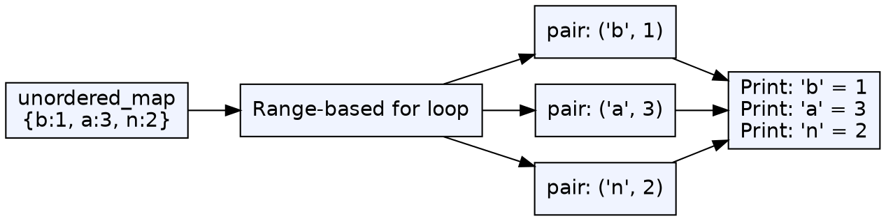
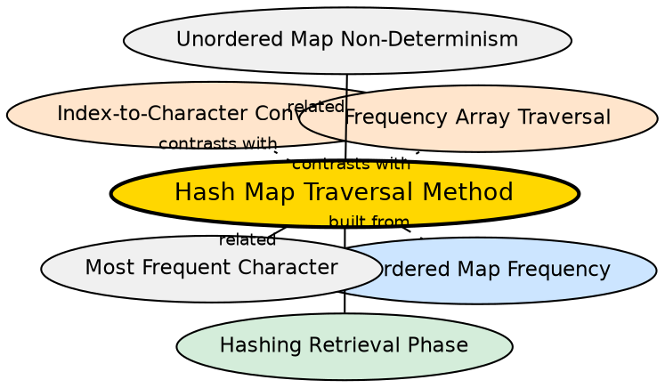

## Formal Definition

Hash map traversal is the process of iterating over all key-value pairs stored in an `unordered_map`. In C++, this is done via range-based for loops over the map, where each element is a `std::pair<const Key, Value>`. Unlike array traversal which iterates a fixed range (0–25), map traversal visits only the actually inserted entries, in unspecified order.

## Explanation

When traversing a frequency array, you loop `i = 0` to `25` and check if `freq[i] > 0`. This visits every slot, including empty ones. When traversing a hash map, you iterate over the stored key-value pairs directly — only the characters that actually appeared. This is more efficient for sparse data but introduces non-deterministic ordering.

## How It Works

1. Obtain an iterator or range: `for(auto& pair : freq)`
2. Each `pair` has `.first` (the key) and `.second` (the value)
3. Process `pair.first` and `pair.second` as needed
4. The iteration visits every stored entry exactly once
5. Order is determined by internal bucket layout, not by key order

## Visual Explanation

## Semantic Network

## Key Properties

- Only visits entries that actually exist — no wasted iterations over empty slots
- Time complexity O(m) where m is distinct characters (not domain size |Σ|)
- No index-to-character conversion needed — the key is already the character
- Iteration order is unspecified and non-deterministic — do not rely on it
- For output, results may appear in different order across runs

## Connections

- Built from: [[unordered-map-frequency|Unordered Map for Frequency Counting]] — traversal is the retrieval method for maps
- Builds into: [[hashing-retrieval-phase|Hashing Retrieval Phase]] — maps have their own traversal pattern in Phase 2
- Contrasts with: [[index-to-character-conversion|Index-to-Character Conversion]] — maps don't need conversion; arrays do
- Contrasts with: [[frequency-array|Frequency Array]] — arrays iterate 0–25; maps iterate stored entries only
- Related: [[unordered-map-non-determinism|Unordered Map Non-Determinism]] — traversal order is unpredictable

## Edge Cases & Gotchas

- For maps with many entries, iteration order changes after rehashing (when load factor exceeds threshold)
- Do NOT modify the map while iterating (adding/removing entries) — this causes undefined behavior
- Using `auto` instead of `auto&` copies each pair — O(n) extra work for large maps
- For ordered output, copy to a vector and sort, or use `std::map` (which has O(log n) operations)
- The loop variable `.first` and `.second` can be confusing to beginners — use structured bindings: `auto& [key, value] : freq`