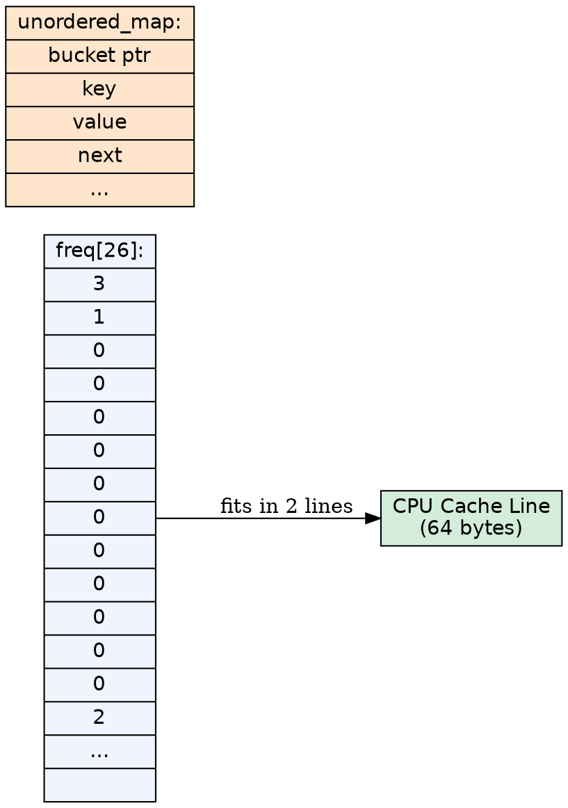
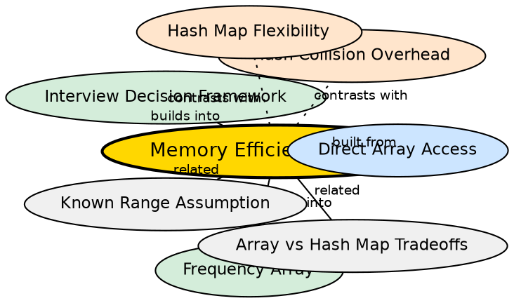

## Formal Definition

A frequency array has memory proportional to the domain size ($O(|\Sigma|)$) regardless of the input size, with zero per-entry overhead beyond the integer storage itself. For lowercase letters, `int freq[26]` occupies exactly $26 \times 4 = 104$ bytes — a fixed cost that does not grow with the string length.

## Explanation

The memory efficiency of a frequency array comes from two properties: it is a fixed-size allocation determined at compile time, and it stores data in a contiguous block with no per-element metadata, no hash table buckets, no linked list pointers, and no key duplication. A hash map, by contrast, stores the key alongside each value, plus internal hash table structures. For small domains, the array's memory advantage is significant.

## How It Works

1. `int freq[26]` allocates 26 × sizeof(int) bytes on the stack (or in static memory)
2. Each slot is accessed via base+offset addressing — no pointers, no indirection
3. The entire array fits in a single CPU cache line (typically 64 bytes × 2 for 104 bytes)
4. No memory is wasted on empty slots — every slot is exactly sized for one integer
5. No heap allocation, no reallocation, no memory fragmentation

## Mathematical Formulation

$$ \text{Memory}_{\text{array}} = |\Sigma| \times \text{sizeof}(\text{element}) $$

$$ \text{Memory}_{\text{array}}(26) = 26 \times 4 = 104 \text{ bytes} $$

$$ \text{Memory}_{\text{map}} = m \times (\text{sizeof}(\text{key}) + \text{sizeof}(\text{value}) + \text{overhead}) $$

where $m$ is the number of distinct characters and overhead includes hash table bucket, pointer chain, and alignment padding.

## Visual Explanation

## Semantic Network

## Key Properties

- Fixed 104 bytes for lowercase English — independent of string length
- Zero per-entry overhead — just the integer value itself
- Stack allocation — no heap fragmentation, no pointer chasing
- Cache-friendly — sequential access pattern leverages spatial locality
- Hash maps typically use 3–5× more memory per entry due to key storage, bucket array, and pointer chains

## Connections

- Built from: [[direct-array-access|Direct Array Access]] — contiguous memory enables efficient addressing <!-- TODO: add backlink here -->
- Builds into: [[frequency-array|Frequency Array]] — memory efficiency is a key advantage of arrays
- Builds into: [[interview-decision-framework|Array vs Hash Map Decision Framework]] — memory is a decision factor
- Contrasts with: [[hash-collision-overhead|Hash Collision Overhead]] — maps pay for collision resolution structures
- Contrasts with: [[hash-map-flexibility|Hash Map Flexibility]] — flexibility comes with memory cost

## Edge Cases & Gotchas

- For very large alphabets (e.g., Unicode with 1M+ code points), the array becomes impractical — int freq[1,114,112] is over 4 MB
- Stack allocation for large arrays causes stack overflow — use heap allocation (std::vector) instead
- If only 3 out of 26 characters appear, the array still uses all 104 bytes — no savings from sparsity
- The memory advantage reverses for sparse data over a large domain: a hash map storing only the 3 appearing characters uses less memory than a full array of the domain
- For multibyte encodings (UTF-8), neither freq[26] nor a simple char map works — the key type must handle variable-length sequences

## Sources

- [[strings-summary|Strings (Character Hashing in C++)]]
