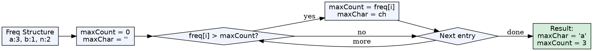
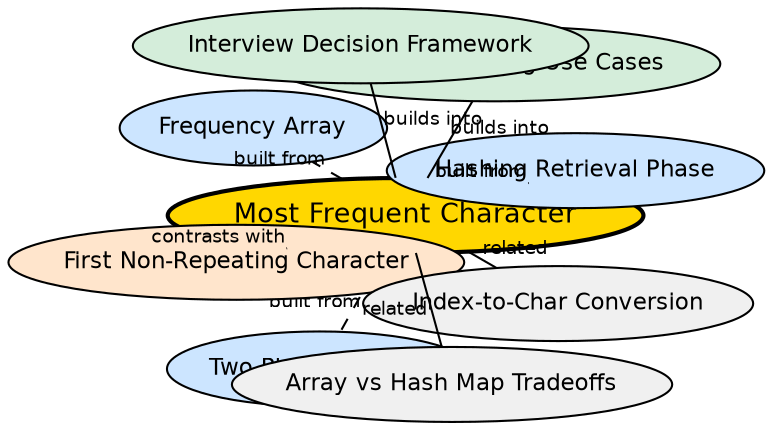

## Formal Definition

Finding the most frequent character in a string using hashing means traversing the frequency structure (array or hash map) after Phase 1 to identify the key-value pair with the maximum count. For ties, any character with the maximum count is acceptable unless otherwise specified.

$$ \text{most\_frequent}(S) = \arg\max_{c \in \text{keys}(H)} H[c] $$

where $H$ is the hash structure built in Phase 1.

## Explanation

After building a frequency array or hash map, the data is stored but not interpreted. Finding the most frequent character is the simplest Phase 2 operation: walk through every entry in the structure, compare counts, and track the current maximum. This teaches the core pattern that Phase 1 is mechanical and Phase 2 is analytical.

## How It Works

1. Complete Phase 1 — build `int freq[26]` or `unordered_map<char,int> freq`
2. Initialize tracking variables: `char maxChar = ' '`, `int maxCount = 0`
3. Traverse the frequency structure:
   - **For array:** loop `i = 0` to `25`, if `freq[i] > maxCount`, update `maxCount = freq[i]`, `maxChar = i + 'a'`
   - **For map:** iterate key-value pairs, if `pair.second > maxCount`, update
4. After traversal, `maxChar` holds the most frequent character

## Visual Explanation

## Semantic Network

## Mathematical Formulation

Given hash structure $H: \text{Key} \to \mathbb{N}$:

$$ \text{result} = \max_{(k,v) \in H} v $$

$$ \text{character} = k \text{ where } (k, \max) \in H $$

## Key Properties

- O(n) Phase 1 (traverse string) + O(|Σ|) or O(m) Phase 2 (traverse structure) = overall O(n)
- Only a constant amount of extra space needed (two tracking variables)
- Works identically for both frequency arrays and hash maps
- For ties, returns the first maximum encountered — order-dependent
- Cannot be solved correctly without Phase 1 — the hash structure is essential

## Connections

- Built from: [[hashing-retrieval-phase|Hashing Retrieval Phase]] — traversing structure for max is a Phase 2 pattern
- Built from: [[two-phase-hashing|Two-Phase Hashing Paradigm]] — follows the store-then-query pattern
- Built from: [[frequency-array|Frequency Array]] — one implementation choice for Phase 1
- Builds into: [[character-hashing-use-cases|Character Hashing Use Cases]] — a canonical example problem <!-- TODO: add backlink here -->
- Contrasts with: [[first-non-repeating-character|First Non-Repeating Character]] — same Phase 1, different Phase 2 traversal <!-- TODO: add backlink here -->
- Related: [[index-to-character-conversion|Index-to-Character Conversion]] — needed to convert the max index back to a character

## Edge Cases & Gotchas

- Empty string: Phase 1 produces an empty structure — handle separately or initialize maxCount to 0 and return a sentinel
- Ties: the problem may expect any character — clarify with the interviewer whether the first, last, or lexicographically smallest should be returned
- Single character string: the answer is that character — works correctly in both structures
- All characters appear once: the first character in traversal order wins (for maps, this is non-deterministic)
- For hash maps, if tied characters exist, the result depends on internal bucket order — non-deterministic across runs

## Sources

- [[strings-summary|Strings (Character Hashing in C++)]]
