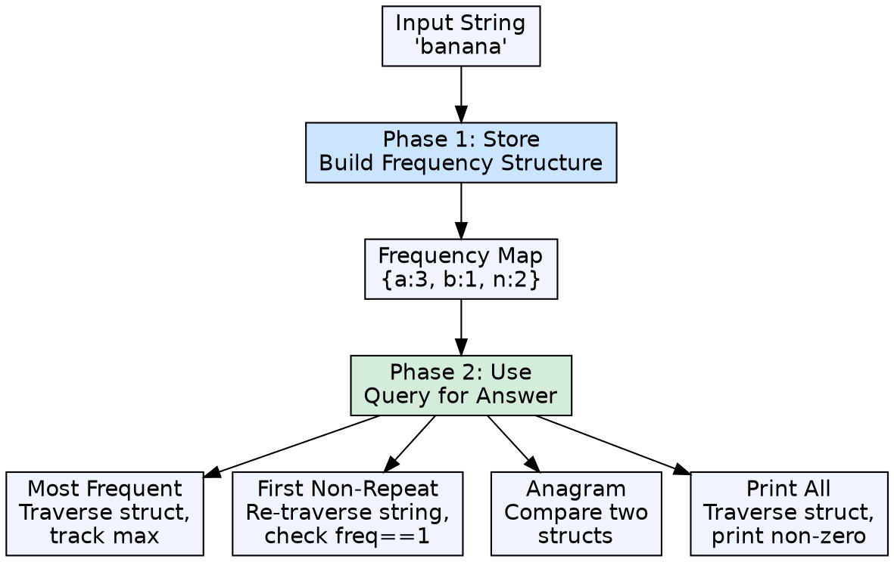
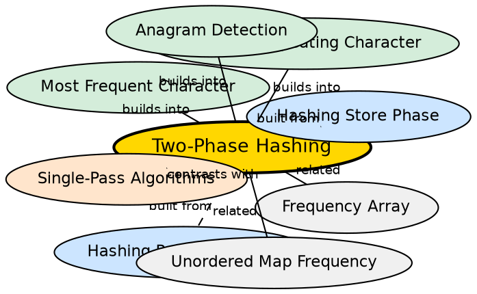

## Formal Definition

Two-phase hashing is the conceptual separation of hash-based problem solving into two distinct phases: Phase 1 (information storage) builds the frequency or mapping structure by processing the input, and Phase 2 (information retrieval) queries that structure to answer the specific problem. Both phases use the same underlying hash structure but with different access patterns.

## Explanation

Beginners often stop after building the frequency structure, unsure what to do next. The key insight is that building the hash is only half the work — the real problem-solving happens in Phase 2, where you traverse or query the structure differently depending on the question. Different problems (most frequent, first non-repeating, anagram detection) all share Phase 1 but diverge in Phase 2.

## How It Works

1. **Phase 1 (Store):** Choose a structure (array or hash map), iterate the input, populate frequencies
2. **Phase 2 (Use):** Query the structure — this could mean finding the max, re-traversing the input for order, or comparing two frequency maps
3. The distinction is mental but powerful: it separates mechanical work from analytical work

## Mathematical Formulation

$$ \text{Phase 1: } H \leftarrow \text{build}(S) \quad \text{where } H \text{ is the hash structure} $$

$$ \text{Phase 2: } \text{answer} \leftarrow \text{query}(H, S) \quad \text{or} \quad \text{answer} \leftarrow \text{query}(H) $$

## Visual Explanation

## Semantic Network

## Key Properties

- Universal pattern across all hash-based string problems
- Phase 1 is nearly identical across problems — only the structure type varies
- Phase 2 varies significantly — this is where problem-specific logic lives
- Understanding this separation is the threshold between beginner and intermediate problem-solving
- Enables modular thinking: change Phase 2 without modifying Phase 1

## Connections

- Built from: [[hashing-store-phase|Hashing Store Phase]] — Phase 1 is the foundation
- Built from: [[hashing-retrieval-phase|Hashing Retrieval Phase]] — Phase 2 is the query layer
- Builds into: [[most-frequent-character|Most Frequent Character]] — uses Phase 1 + Phase 2 (traverse struct for max)
- Builds into: [[first-non-repeating-character|First Non-Repeating Character]] — uses Phase 1 + Phase 2 (re-traverse string)
- Builds into: [[anagram-detection-via-hashing|Anagram Detection]] — uses Phase 1 for two strings + Phase 2 (compare)
- Related: [[character-hashing-use-cases|Character Hashing Use Cases]] — catalog of problems following this pattern

## Edge Cases & Gotchas

- Some problems can be solved in one pass (Phase 1 and 2 interleaved) — the two-phase model is conceptual, not always sequential
- For first non-repeating character, Phase 2 re-traverses the original string, not the hash structure — a common confusion point
- For anagram detection, Phase 1 runs twice (once per string), then Phase 2 compares — the phases apply per-string
- Overlapping Phase 1 and 2 can be more efficient but harder to reason about