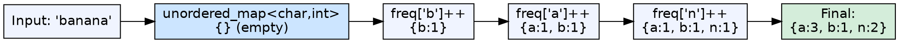
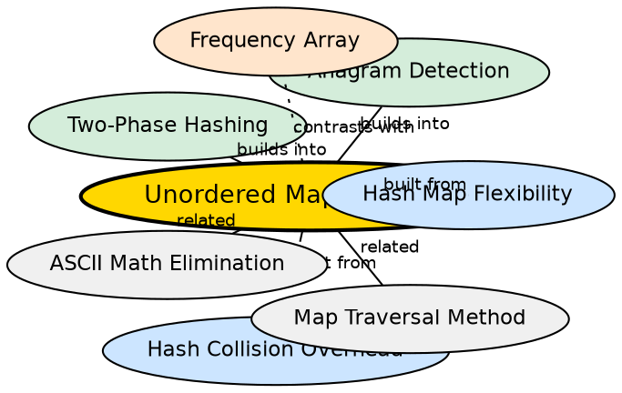

## Formal Definition

An unordered map (hash map) for frequency counting uses `std::unordered_map<Key, int>` where each key is an element from the input and the mapped value is its occurrence count. Unlike a frequency array, the map only stores entries for elements that actually appear, and keys can be of any hashable type.

## Explanation

When the character range is unknown, large, or non-contiguous (e.g., mixed case, digits, Unicode), a frequency array becomes impractical. An `unordered_map<char, int>` stores only the characters that actually appear, with no ASCII math needed — `freq[ch]` works directly. The tradeoff is hashing overhead, potential collisions, and non-deterministic iteration order.

## How It Works

1. Declare `unordered_map<char, int> freq`
2. Iterate through the string: `for(char ch : s) { freq[ch]++; }`
3. The map automatically creates new key-value pairs for new characters
4. To query: iterate key-value pairs or check specific keys
5. No conversion needed — character is used as the key directly

## Visual Explanation

## Semantic Network

## Key Properties

- Average O(1) insertion and lookup (amortized, may degrade to O(n) with collisions)
- Only stores distinct elements — memory proportional to unique characters, not domain size
- Keys can be any hashable type: `char`, `string`, `int`, `long long`
- No `ch - 'a'` conversion needed — eliminates ASCII math entirely
- Iteration order is unspecified and non-deterministic

## Connections

- Built from: [[hash-map-flexibility|Hash Map Flexibility]] — unordered_map supports diverse key types <!-- TODO: add backlink here -->
- Built from: [[hash-collision-overhead|Hash Collision Overhead]] — the performance tradeoff of hash maps <!-- TODO: add backlink here -->
- Builds into: [[two-phase-hashing|Two-Phase Hashing Paradigm]] — maps are one implementation choice for Phase 1
- Builds into: [[anagram-detection-via-hashing|Anagram Detection]] — maps are ideal when character set is unknown
- Contrasts with: [[frequency-array|Frequency Array]] — array is faster for small known ranges; map is more flexible
- Related: [[ascii-math-elimination|ASCII Math Elimination]] — maps eliminate the need for index conversion <!-- TODO: add backlink here -->

## Edge Cases & Gotchas

- `freq[ch]++` creates an entry with value 0 if the key does not exist, then increments — no manual insertion needed
- Repeated insertions may trigger rehashing, which is O(n) amortized but can be a latency spike
- `unordered_map` is not ordered — if you need sorted output, use `map` (O(log n) per operation) or sort the result
- For small datasets (like lowercase-only strings), a map is slower than a frequency array despite both being O(1) — the constant factors matter
- Memory per entry is higher than an array slot due to key storage, hash table overhead, and pointer chains

## Sources

- [[strings-summary|Strings (Character Hashing in C++)]]
