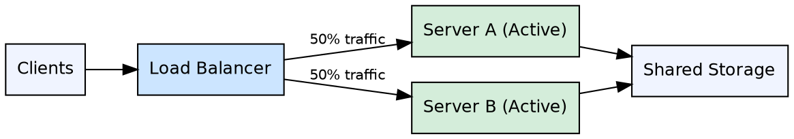

## The Problem

Standby servers in active-passive setups remain idle, wasting compute resources and providing no return on the hardware investment.

## Core Idea

In active-active failover, both servers manage traffic simultaneously, spreading the load between them and eliminating idle resources.

## How It Works

1. Both servers are active and handle client requests concurrently.
2. A load balancer or DNS distributes incoming traffic across both servers.
3. If one server fails, the remaining server continues handling all traffic (with degraded capacity).
4. DNS must be configured with both IP addresses for public-facing services.
5. Application logic must be aware of both servers for internal communication.
6. Also called master-master failover.

## Visual Explanation

## Key Properties

- No idle resources — both servers handle traffic
- Load is spread between both servers, improving throughput
- DNS or application must be aware of both server IPs
- Capacity is degraded (not lost) on single-server failure
- Also called master-master failover

## Connections

- **Contrasts with:** [[active-passive-failover|Active-Passive Failover]] — both active vs one standby
- **Related:** [[availability-nines|Availability Nines]] — active-active improves overall availability
- **Related:** [[layer4-load-balancing|Layer 4 Load Balancing]] — load balancers distribute traffic in active-active
- **Related:** [[horizontal-scaling|Horizontal Scaling]] — active-active is a form of horizontal scaling

## Edge Cases & Gotchas

- Session affinity (sticky sessions) becomes harder — requests from one user may hit different servers
- Both servers must have consistent state or share storage to avoid data divergence
- Failover capacity is only 50% — if one server dies, the remaining server must handle full load