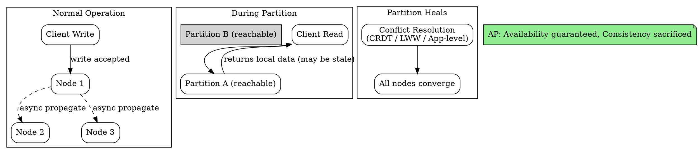

## The Problem

Some systems must remain operational during network partitions, even if the data served might be stale. Social media feeds, content delivery, and collaborative tools cannot show errors to users.

## Core Idea

AP systems choose availability over consistency during network partitions. Every request receives a response using the most readily available version of the data. Writes are accepted and propagated asynchronously — when the partition resolves, nodes reconcile any conflicts. The system is always responsive but may serve stale or divergent data temporarily.

## How It Works

1. **Pre-partition**: Nodes replicate data asynchronously. A write to one node is propagated to others in the background. Reads may return slightly stale data.
2. **Partition occurs**: A subset of nodes becomes unreachable. Each partition group continues operating independently.
3. **Serve what you have**: Reachable nodes accept reads and writes using local data. No request is refused.
4. **Conflict resolution**: When the partition heals, nodes exchange write logs. Conflicting writes are resolved using a strategy (last-write-wins, CRDT merge, application-level reconciliation).
5. **Convergence**: All nodes eventually converge to the same state.

## Visual Explanation

## Key Properties

- **Always returns a response**: No request is rejected or timed out due to consistency concerns
- **May return stale data**: Reads reflect the latest write the responding node has seen, which may lag behind
- **Writes eventually propagate**: Asynchronous replication means write conflicts are resolved post-facto
- **Common in social media, CDNs, DNS**: Applications where availability matters more than absolute consistency

## Connections

- **Built from:** [[cap-theorem|CAP Theorem]]
- **Contrasts with:** [[cp-consistency-partition-tolerance|CP — Consistency and Partition Tolerance]]
- **Related:** [[eventual-consistency|Eventual Consistency]] — AP systems implement eventual consistency
- **Related:** [[cdn-push|Push CDN]] — an AP system that serves content despite partitions

## Edge Cases & Gotchas

- **Conflict resolution is hard**: Last-write-wins can silently discard data. CRDTs avoid data loss but are complex to implement. Application-level merging (e.g., collaborative editing) may require user intervention.
- **Stale reads can compound**: If many reads traverse a chain of eventually-consistent replicas, staleness can accumulate beyond expected bounds.
- **Not appropriate for all data**: Financial transactions, inventory counts, and lock services generally cannot tolerate AP behavior.

## Sources

- [[readmemd-summary|System Design Primer Summary]]
