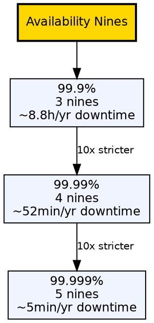

## The Problem

Uptime guarantees need a standardized measurement to compare systems and set meaningful SLAs between providers and customers.

## Core Idea

Availability is quantified by uptime percentage — "number of 9s" (99.9% = three 9s, 99.99% = four 9s). Each additional 9 represents a tenfold reduction in allowed downtime.

## How It Works

1. Availability is calculated as uptime divided by total time over a measurement period.
2. 99.9% (three 9s) permits approximately 8 hours 45 minutes of downtime per year.
3. 99.99% (four 9s) permits approximately 52 minutes of downtime per year.
4. 99.999% (five 9s) permits approximately 5 minutes of downtime per year.
5. Each additional 9 requires exponentially more redundancy and operational discipline.

## Visual Explanation

## Key Properties

- Measured in "number of 9s" — 99.9%, 99.99%, 99.999%
- Each additional 9 is a 10x reduction in allowed downtime
- Three 9s = 99.9% uptime
- Four 9s = 99.99% uptime
- Five 9s = 99.999% uptime

## Connections

- **Built from:** [[availability-parallel-vs-sequence|Availability in Parallel vs Sequence]] — how component availability combines to produce overall nines
- **Related:** [[active-passive-failover|Active-Passive Failover]] — failover pattern increases achievable nines
- **Related:** [[active-active-failover|Active-Active Failover]] — active-active improves achievable nines
- **Related:** [[horizontal-scaling|Horizontal Scaling]] — adding nodes increases availability through redundancy

## Edge Cases & Gotchas

- Nines are calculated over a full year — a single prolonged outage can blow through the entire budget
- "Five 9s" is extraordinarily difficult in practice, requiring redundant everything (power, network, servers, data centers)
- Partial outages (degraded but not down) are often excluded from SLA calculations, masking real availability

## Sources

- [[readmemd-summary|System Design Primer Summary]] — availability section with nines calculation
