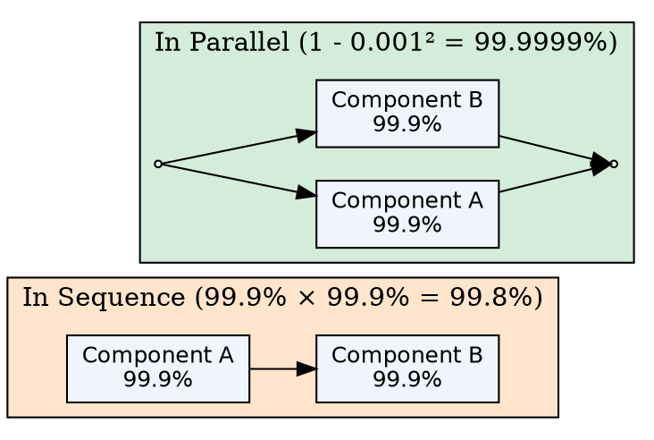

## The Problem

When a system has multiple components, overall availability depends on how they are connected. Naively combining component availability gives misleading results.

## Core Idea

Components in sequence multiply their availability together (making total availability worse), while components in parallel multiply their unavailability together (making total availability dramatically better).

## How It Works

1. **Sequence formula:** `Avail(Total) = Avail(A) × Avail(B)`. Two 99.9% components in series yield 99.8% — worse than either alone.
2. **Parallel formula:** `Avail(Total) = 1 - (1 - Avail(A)) × (1 - Avail(B))`. Two 99.9% components in parallel yield 99.9999% — better than either alone.
3. Parallel systems only fail if both (or all) redundant components fail simultaneously.

## Visual Explanation

## Key Properties

- Sequential components multiply availability — total is always _worse_ than the worst component
- Parallel components multiply unavailability — total is always _better_ than the best component
- Fundamental principle underlying all reliability engineering and redundancy design

## Connections

- **Builds into:** [[availability-nines|Availability Nines]] — the formula behind nines calculations
- **Related:** [[active-passive-failover|Active-Passive Failover]] — parallel arrangement of servers for failover
- **Related:** [[active-active-failover|Active-Active Failover]] — parallel arrangement for load sharing and redundancy
- **Related:** [[horizontal-scaling|Horizontal Scaling]] — adding parallel nodes improves overall system availability

## Edge Cases & Gotchas

- Components are rarely perfectly independent — shared power supplies, network links, or data centers create common-mode failures that violate the parallel model
- The parallel formula assumes instant failover, but real failover has non-zero downtime that reduces effective availability
- Very long dependency chains (many sequential components) degrade availability drastically — a system with ten 99.9% components in series is only 99.0% available

## Sources

- [[readmemd-summary|System Design Primer Summary]] — availability section on combining component availability
