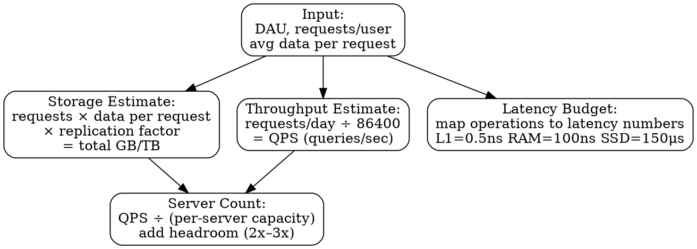

## The Problem

System design interviews and architecture decisions require quick quantitative estimates to determine whether a design is feasible — how much storage is needed, how many servers are required, what the bottleneck will be — without access to calculators or reference systems.

## Core Idea

Back-of-the-envelope estimation uses powers of two for data sizing (2^10 = 1024 ≈ 1K, 2^20 ≈ 1M, 2^30 ≈ 1G) and known latency numbers (L1 cache 0.5ns, RAM 100ns, SSD 150μs, HDD 10ms, datacenter round-trip 500μs) to quickly approximate capacity, throughput, and performance of a system design.

## How It Works

1. **Powers of Two**: memorize the table: 2^10 = 1K, 2^20 = 1M, 2^30 = 1G, 2^40 = 1T. Use these to estimate storage: a 4-byte integer, 1KB text document, 1MB image, etc.

2. **Latency Numbers**: memorize the approximate time each operation takes — L1 cache reference (0.5ns), branch mispredict (5ns), L2 cache reference (7ns), mutex lock/unlock (100ns), main memory reference (100ns), compress 1KB with Zippy (10μs), send 2KB over 1 Gbps (20μs), SSD random read (150μs), disk seek (10ms), datacenter round trip (500μs).

3. **Combine**: for a given design, multiply the per-operation cost by the request volume. Example: 10M daily active users, each generating 100 requests/day = 1B requests/day ≈ 12K requests/sec. Then multiply by per-request CPU/memory/IO to estimate total resources.

## Visual Explanation

## Key Properties

- **2^10 = 1024 ≈ 1000 (K)** — approximate for quick estimation
- **2^20 ≈ 1 million (M)** — typical for DAU and QPS estimates
- **2^30 ≈ 1 billion (G)** — typical for storage estimates
- **Memory is 80,000x faster than disk** — 100ns RAM vs 10ms HDD seek
- **Datacenter round-trip dominates** — 500μs is 5,000x slower than a RAM access

## Connections

- **Related:** [[performance-vs-scalability|Performance vs Scalability]] — estimates quantify both dimensions: latency measures performance, throughput measures scalability
- **Related:** [[latency-vs-throughput|Latency vs Throughput]] — estimates use latency numbers to compute throughput bounds
- **Related:** [[horizontal-scaling|Horizontal Scaling]] — estimates determine how many nodes are needed to achieve target throughput
- **Related:** [[availability-nines|Availability Nines]] — estimates help calculate uptime requirements and redundant capacity
- **Related:** [[cache-aside|Cache-Aside]] — latency estimates reveal when caching is necessary (disk reads at 10ms vs cache at 100ns)

## Edge Cases & Gotchas

- **Orders of magnitude matter, exact numbers don't** — if your estimate is off by 2x, that's fine; if it's off by 100x, the design is likely infeasible.
- **Latency numbers are for the median** — p99 latency can be 10-100x worse due to GC pauses, network jitter, and queueing; always add headroom.
- **Throughput ≠ latency** — a system can handle 10K QPS (good throughput) but have 500ms p99 latency (bad); estimate both independently.

## Sources

- [[readmemd-summary|System Design Primer Summary]]
