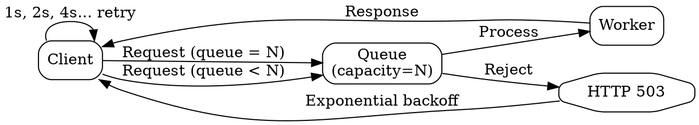

## The Problem

Unbounded queue growth under high load causes memory exhaustion, increased cache misses, and eventual system collapse. Without limits, backlog accumulates faster than workers can drain it.

## Core Idea

Back pressure limits the size of a queue to maintain throughput and response times for already-accepted work. When the queue reaches its configured capacity, new requests are rejected — typically with HTTP 503 (Service Unavailable) — and clients retry with exponential backoff.

## How It Works

1. Set a maximum queue size based on memory and throughput constraints.
2. When the queue reaches this limit, reject new incoming requests.
3. Return HTTP 503 Service Unavailable to the client.
4. Client retries using exponential backoff (1s, 2s, 4s, 8s... with jitter).
5. Throughput for already-queued jobs is preserved — the system degrades gracefully instead of collapsing.

## Visual Explanation

## Key Properties

- Prevents memory exhaustion from unbounded queue growth
- Maintains throughput for jobs already accepted into the queue
- Rejected clients receive well-defined HTTP 503 responses
- Exponential backoff with jitter prevents thundering herd on retry
- Preserves overall system stability by shedding load at the boundary

## Connections

- Related: [[message-queues|Message Queues]] — back pressure protects message queues from overload
- Related: [[task-queues|Task Queues]] — back pressure prevents task queues from growing unboundedly
- Related: [[latency-vs-throughput|Latency vs Throughput]] — back pressure maintains stable throughput by rejecting excess load
- Related: [[horizontal-scaling|Horizontal Scaling]] — sustained back pressure is a signal to scale out the worker pool

## Edge Cases & Gotchas

- **Retry storms**: Without jitter, all clients retry simultaneously, creating a thundering herd on the queue. Always add random jitter to backoff intervals.
- **Queue sizing**: Too small a queue underutilizes workers; too large defeats the purpose. Size based on expected worker drain rate and acceptable latency.
- **No back pressure on workers**: If workers themselves slow down (e.g., due to DB contention), back pressure at the queue level doesn't protect upstream resources.

## Sources

- [[readmemd-summary|System Design Primer Summary]]
