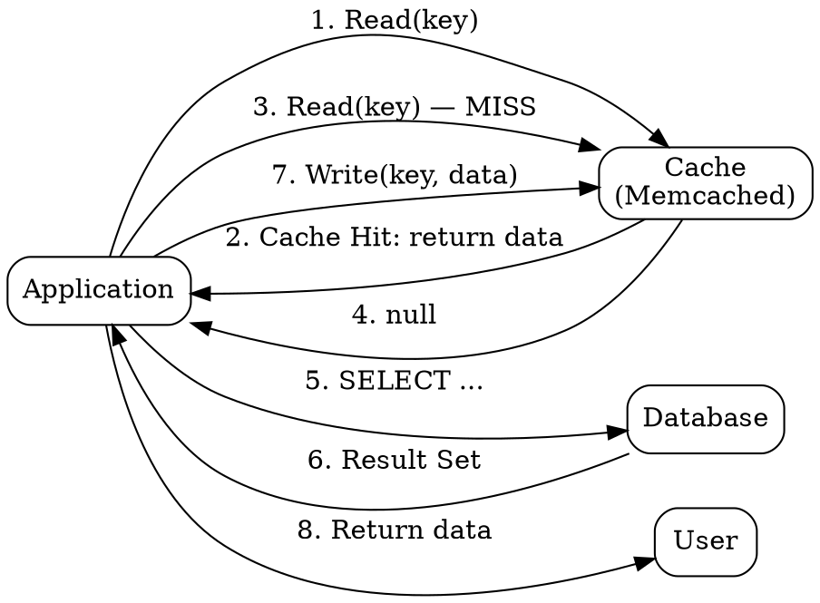

## The Problem

Databases are slow for frequently accessed data. Pre-loading all possible data into cache proactively wastes memory and is impractical at scale.

## Core Idea

Cache-aside (lazy loading) puts the application in charge of the cache — it loads data into cache on demand only when a cache miss occurs. The application checks the cache first, falls back to the database on a miss, and populates the cache for subsequent reads.

## How It Works

1. Application checks cache for the requested entry.
2. If found (cache hit), return the data immediately.
3. If not found (cache miss), load the data from the database.
4. Store the retrieved data in the cache with a TTL.
5. Return the data to the caller.
6. Subsequent requests for the same key will hit the cache until the TTL expires.

Memcached is typically used in this pattern. Only data that is actually requested ends up in the cache.

## Visual Explanation

## Key Properties

- Application manages cache lifecycle explicitly
- Lazy loading — only requested data is cached (on-demand)
- Cache does not interact with the database directly
- Each cache miss costs 3 round trips (check cache, load DB, write cache)
- Avoids filling cache with unused data, keeping memory efficient

## Connections

- Contrasts with: [[write-through-cache|Write-Through Cache]] — lazy vs eager write
- Contrasts with: [[write-behind-cache|Write-Behind Cache]] — synchronous vs async write
- Related: [[cdn-pull|Pull CDN]] — similar on-demand pull pattern
- Related: [[refresh-ahead-cache|Refresh-Ahead Cache]] — proactive vs reactive refresh

## Edge Cases & Gotchas

- **Cache stampede**: If many requests miss simultaneously (e.g., after TTL expiry), all hit the database at once. Mitigate with mutex locks or early recomputation.
- **Stale data**: If the database is updated directly (bypassing cache), the cache serves stale data until TTL expiry.
- **Thundering herd**: A popular key's TTL expiry can trigger a database overload from concurrent misses.