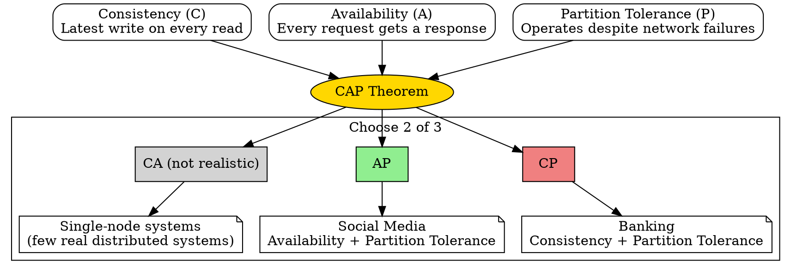

## The Problem

Distributed systems must handle network partitions (when nodes cannot communicate). Designers need a framework to reason about what properties a distributed system can guarantee under such failures.

## Core Idea

The CAP Theorem states that a distributed data store can simultaneously provide at most two of three guarantees: **Consistency** (every read receives the most recent write or an error), **Availability** (every request receives a non-error response), and **Partition Tolerance** (the system continues operating despite arbitrary network failures). Since network partitions are inevitable, designers effectively choose between CP (Consistency + Partition Tolerance) and AP (Availability + Partition Tolerance).

## How It Works

1. **Normal operation**: All three properties are satisfied — nodes communicate, reads are consistent, responses are returned.
2. **Partition occurs**: Network failure splits nodes into groups that cannot communicate.
3. **CP choice**: The system refuses responses from nodes that cannot be confirmed as consistent — returns errors or timeouts until the partition heals.
4. **AP choice**: The system returns whatever data is available from reachable nodes, accepting that data may be stale. Writes are queued and merged when the partition resolves.

## Visual Explanation

## Key Properties

- **C (Consistency)**: Every read receives the most recent write or an error
- **A (Availability)**: Every request receives a (non-error) response, without guarantee it contains the latest write
- **P (Partition Tolerance)**: The system continues to function despite network partitions
- **P is mandatory in distributed systems** — networks are unreliable by nature
- **CA is a theoretical option** that only applies to single-node systems or systems that can guarantee no network faults

## Connections

- **Builds into:** [[cp-consistency-partition-tolerance|CP — Consistency and Partition Tolerance]]
- **Builds into:** [[ap-availability-partition-tolerance|AP — Availability and Partition Tolerance]]
- **Related:** [[strong-consistency|Strong Consistency]] — guaranteed in CP systems
- **Related:** [[eventual-consistency|Eventual Consistency]] — used in AP systems

## Edge Cases & Gotchas

- **PACELC extension**: CAP only considers partitions. PACELC adds that even without a partition (Else), there's a latency-consistency trade-off. Most systems don't operate in partition mode.
- **CA is misleading**: Single-node systems aren't distributed. Therefore, real distributed systems are either CP or AP.
- **Partition recovery is not automatic**: When a partition heals, reconciliation logic is needed — stale writes may conflict, and resolution strategies (last-write-wins, CRDTs, etc.) must be in place.

## Sources

- [[readmemd-summary|System Design Primer Summary]]
