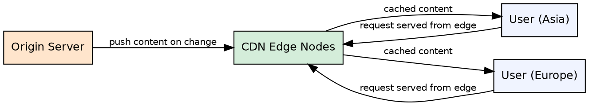

## The Problem

Serving all content from a single origin server creates latency for distant users and places heavy load on the origin infrastructure.

## Core Idea

Push CDNs receive new content whenever changes occur on the server — the server proactively uploads content to the CDN edge nodes.

## How It Works

1. When content is created or updated on the origin server, the server uploads it to the CDN.
2. The CDN distributes the content to its edge nodes worldwide.
3. URLs in the application are rewritten to point to the CDN endpoint.
4. User requests hit the nearest CDN edge, which serves the pre-pushed content.
5. Content expires from the CDN based on a configured TTL or is explicitly invalidated.
6. Best suited for sites with low traffic or content that changes infrequently.

## Visual Explanation

## Key Properties

- Server-initiated content push — origin decides what to upload
- Full responsibility for content distribution lies with the origin server
- Content is uploaded only when it changes (not on every request)
- Minimizes origin traffic but may waste CDN storage for rarely accessed content
- Best suited for low-traffic sites or content with predictable access patterns

## Connections

- **Contrasts with:** [[cdn-pull|Pull CDN]] — server-push vs lazy-pull content delivery strategies
- **Related:** [[dns-system-design|DNS in System Design]] — DNS directs clients to the nearest CDN edge
- **Related:** [[reverse-proxy-pattern|Reverse Proxy]] — both serve cached content closer to users

## Edge Cases & Gotchas

- Cache invalidation is difficult — if content needs to be removed, you must explicitly purge it from all CDN edges
- Pushing content that nobody ever requests wastes CDN storage
- If the push mechanism fails, stale content remains served until manually invalidated