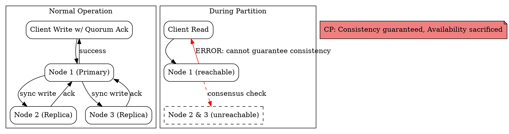

## The Problem

When a network partition occurs, the system must decide whether to return potentially stale data or refuse to respond. Applications like banking and inventory management cannot tolerate stale reads.

## Core Idea

CP systems choose consistency over availability during network partitions. When nodes cannot verify they have the latest data, the system returns errors or times out rather than serving stale data. Consistency is guaranteed at all times, but availability is sacrificed during partitions.

## How It Works

1. **Pre-partition**: All nodes agree on the latest write. Reads go to any node and return the same value. Writes must be acknowledged by a majority/quorum before the client receives confirmation.
2. **Partition occurs**: A subset of nodes becomes unreachable. The reachable nodes cannot confirm whether the isolated nodes have accepted a newer write.
3. **Reject to be safe**: The reachable nodes refuse reads (return error or timeout) because they cannot guarantee the returned value is the most recent write.
4. **Partition heals**: Nodes re-establish communication. Reconciliation replays any writes that were accepted by the isolated minority. The system resumes full operation.

## Visual Explanation

## Key Properties

- **Atomic consistent reads**: Every read returns the latest write or an error — never stale data
- **May return errors during partition**: Availability drops to zero for the affected data
- **Business-critical use cases**: Banking, inventory, booking systems where stale data causes real harm
- **Synchronous replication**: Writes are synchronously replicated to a quorum before acknowledgment

## Connections

- **Built from:** [[cap-theorem|CAP Theorem]]
- **Contrasts with:** [[ap-availability-partition-tolerance|AP — Availability and Partition Tolerance]]
- **Related:** [[strong-consistency|Strong Consistency]] — CP systems guarantee strong consistency
- **Related:** [[master-slave-replication|Master-Slave Replication]] — reading from master ensures strong consistency (a CP pattern)

## Edge Cases & Gotchas

- **Quorum failure**: If a majority of nodes are lost during partition, the system becomes read-only or entirely unavailable until the partition resolves.
- **Tail latency in normal operation**: The synchronous replication quorum means the slowest node in the quorum determines write latency.
- **Not all CP is equal**: Some CP systems (e.g., ZooKeeper) prioritize partition recovery speed, while others (e.g., traditional RDBMS with sync replication) may remain unavailable for longer.

## Sources

- [[readmemd-summary|System Design Primer Summary]]
