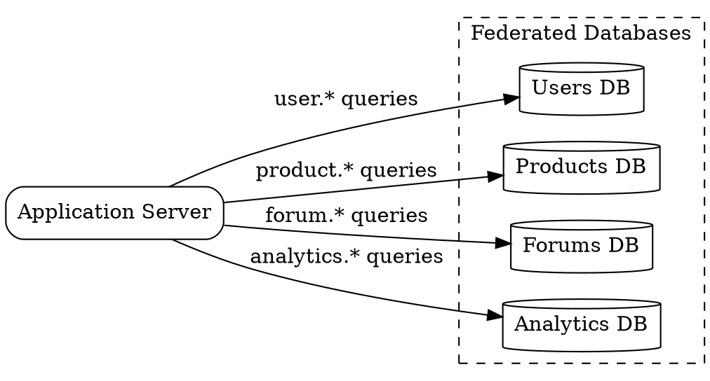

## The Problem

A single monolithic database handling all application functions (users, products, forums, analytics) creates bottlenecks. It becomes a shared contention point for writes, its replication lag affects every feature, and a schema change for one domain risks affecting unrelated features.

## Core Idea

Federation splits databases by business function — forums, users, and products each get their own dedicated database. This reduces write contention, shrinks replication lag, improves cache locality, and allows each database to be tuned for its specific workload.

## How It Works

1. Identify functional domains in the application (e.g., users, products, forums, analytics).
2. Create a separate database instance for each domain.
3. Route all reads and writes for a domain to its dedicated database.
4. Each database operates independently — its own replication topology, backup schedule, and schema.
5. Application logic or an API gateway determines which database to query based on the operation.
6. Cross-database queries are handled in application code (two separate queries joined in memory).

## Visual Explanation

## Key Properties

- **Function-based splitting** — each database owns a distinct business domain
- **Smaller databases** — less data per DB means faster backups, lower replication lag
- **Reduced contention** — writes to users don't block writes to products
- **More cache hits** — domain-specific working sets fit better in memory
- **Requires application routing** — the application layer must know which DB to query

## Connections

- **Related:** [[sharding|Sharding]] — federation splits by function, sharding splits by key (both are forms of data partitioning)
- **Contrasts with:** monolithic database — single shared DB vs multiple function-specific DBs
- **Related:** [[denormalization|Denormalization]] — often needed with federation since cross-DB joins are impractical
- **Related:** [[microservices-architecture|Microservices Architecture]] — the database-per-service pattern is a natural fit for microservices
- **Related:** [[master-slave-replication|Master-Slave Replication]] — each federated database can have its own replication topology

## Edge Cases & Gotchas

- **Cross-domain queries** — a report that needs user names and product names requires two database queries and application-level join, which is slower than a SQL JOIN.
- **Uneven load distribution** — one domain (users) may have 100x the traffic of another (analytics), requiring different infrastructure per federation.
- **Transaction boundaries** — an operation that updates both users and forums cannot use a cross-database ACID transaction; requires a saga or eventual consistency pattern.

## Sources

- [[readmemd-summary|System Design Primer Summary]]
