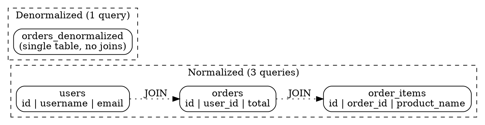

## The Problem

Complex SQL joins across normalized tables become prohibitively expensive as data grows — especially when joins span shards, federated databases, or high-traffic tables. These joins add milliseconds to query time, which compounds under load.

## Core Idea

Denormalization intentionally adds redundant copies of data across multiple tables to avoid expensive joins at read time. This improves read performance at the cost of write performance — reads become fast single-table lookups, but writes must update multiple copies of the data.

## How It Works

1. Profile query patterns to identify frequent, expensive joins.
2. Add redundant columns to tables that are frequently joined together (e.g., store `username` in the `orders` table instead of joining `users`).
3. On write operations, update all copies of the redundant data — either in application code or via database triggers.
4. Use materialized views (PostgreSQL, Oracle) that automatically refresh the denormalized result set on a schedule or on change.
5. Monitor consistency — periodic reconciliation jobs can detect and fix diverging copies.

## Visual Explanation

## Key Properties

- **Improves read performance** — single-table lookups instead of multi-table joins
- **Adds data redundancy** — the same information exists in multiple places
- **Writes become more expensive** — every write must update all redundant copies
- **Constraints help maintain consistency** — foreign keys and check constraints reduce drift
- **Materialized views automate management** — database-native denormalization with refresh schedules

## Connections

- **Related:** [[sql-tuning|SQL Tuning]] — denormalization is a specific SQL optimization technique
- **Related:** [[sharding|Sharding]] — denormalization avoids expensive cross-shard joins by colocating related data
- **Related:** [[database-federation|Database Federation]] — reduces the need for cross-database joins by duplicating reference data
- **Contrasts with:** normalized schema — third-normal-form (3NF) eliminates redundancy; denormalization reintroduces it intentionally
- **Related:** [[nosql-database-types|NoSQL Database Types]] — NoSQL databases are inherently denormalized; joins are done in application code

## Edge Cases & Gotchas

- **Data drift** — if one copy of the data is updated but another is not, queries return inconsistent results; write atomicity is critical.
- **Storage bloat** — redundant copies increase disk usage; factor in at least 2x–3x storage for heavily denormalized schemas.
- **Update anomaly complexity** — a single logical change (user changes their name) may need to update dozens of denormalized copies across multiple tables or databases.