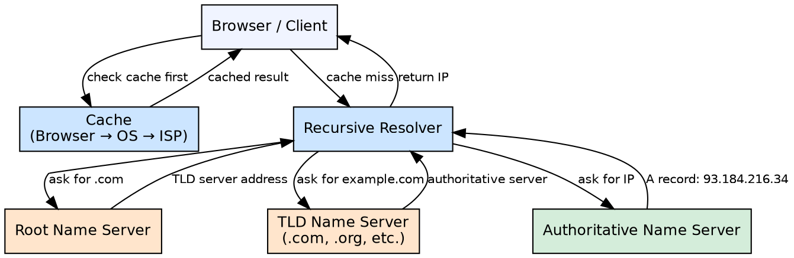

## The Problem

Users cannot remember numerical IP addresses for every service they access. A human-readable naming system that scales globally is needed.

## Core Idea

DNS translates domain names (www.example.com) to IP addresses using a hierarchical, distributed system of name servers with caching at every level.

## How It Works

1. A user types a domain name into a browser.
2. The browser checks its local cache, then the OS cache, then the ISP resolver.
3. The recursive resolver queries the root name server for the TLD server.
4. The TLD server directs to the authoritative name server for the domain.
5. The authoritative server returns the IP address (A record) or other record type.
6. Results are cached at each level for the duration of the TTL.
7. Record types include A (address), CNAME (canonical name), MX (mail exchange), NS (name server).

## Visual Explanation

## Key Properties

- Hierarchical tree structure: root → TLD → authoritative
- Cached at multiple levels: browser, OS, ISP resolver
- TTL (Time To Live) controls how long entries are cached
- Supports weighted routing, latency-based routing, and geo-routing via managed DNS providers
- Managed DNS services: Route53, CloudFlare DNS, Google Cloud DNS

## Connections

- **Related:** [[cdn-push|Push CDN]] — DNS routes users to the nearest CDN edge server
- **Related:** [[cdn-pull|Pull CDN]] — DNS resolution directs users to the appropriate CDN endpoint
- **Related:** [[layer4-load-balancing|Layer 4 Load Balancing]] — DNS can distribute traffic across multiple server IPs
- **Related:** [[active-active-failover|Active-Active Failover]] — DNS must be configured with all active server IPs

## Edge Cases & Gotchas

- DNS propagation delays mean changes to records take time (up to 48 hours for TTL expiration everywhere)
- DNS is vulnerable to cache poisoning attacks if DNSSEC is not implemented
- CNAME records cannot coexist with other record types at the same DNS node — use ALIAS or ANAME records instead