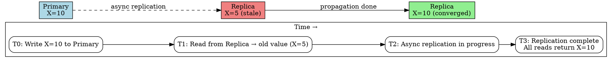

## The Problem

Strong consistency limits availability and throughput because it requires synchronous coordination before every read. Many applications can tolerate temporary inconsistency in exchange for higher availability and lower latency.

## Core Idea

After a write, reads will eventually see it — typically within milliseconds — as data is replicated asynchronously across nodes. The system guarantees convergence: given enough time without new writes, all replicas will hold the same value. Between the write and convergence, reads may return stale data.

## How It Works

1. **Client writes to one node**: The write is acknowledged immediately without waiting for replicas. The write is placed in a replication log.
2. **Asynchronous propagation**: The replication log is streamed to other nodes in the background. Propagation delay depends on network latency, load, and batch size.
3. **Stale reads during window**: A read to a node that hasn't received the replication log returns the old value.
4. **Convergence**: Once all replicas have processed the log, every read returns the latest write. If no new writes occur, the system becomes consistent.

## Visual Explanation

## Key Properties

- **Convergence guaranteed**: Given no new writes, all replicas will eventually hold the same value
- **Asynchronous replication**: Writes are acknowledged immediately; replication happens in the background
- **Temporary inconsistency window**: Brief period between write and full propagation where stale reads are possible
- **Works in DNS (TTL propagation), email (SMTP delay), and many NoSQL databases (DynamoDB, Cassandra)**

## Connections

- **Contrasts with:** [[strong-consistency|Strong Consistency]] — sync vs async replication, guarantees vs temporary inconsistency
- **Contrasts with:** [[weak-consistency|Weak Consistency]] — eventual guarantees convergence, weak does not
- **Related:** [[ap-availability-partition-tolerance|AP — Availability and Partition Tolerance]] — AP systems use eventual consistency as their consistency model
- **Related:** [[master-slave-replication|Master-Slave Replication]] — slaves are eventually consistent with the master
- **Related:** [[dns-system-design|DNS in System Design]] — DNS uses eventual consistency with TTL-based caching

## Edge Cases & Gotchas

- **Write conflicts**: Concurrent writes to different replicas may produce conflicts that require reconciliation (last-write-wins, CRDTs, application-level merging).
- **Staleness bounds are application-defined**: DNS uses TTLs to bound inconsistency. Without explicit bounds, staleness can grow arbitrarily under heavy load or network issues.
- **Read-your-write consistency is not guaranteed**: A client that writes to one node and immediately reads from another may not see its own write. Session consistency or quorum reads can mitigate this.

## Sources

- [[readmemd-summary|System Design Primer Summary]]
