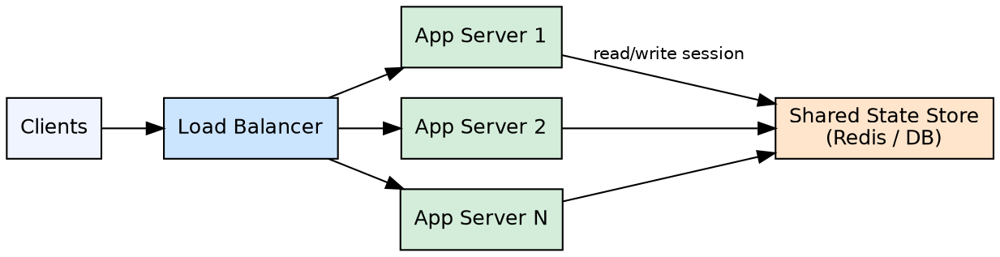

## The Problem

Vertical scaling (buying a bigger server) hits diminishing returns — costs grow super-linearly while performance gains taper off, and high-end hardware requires specialized expertise.

## Core Idea

Horizontal scaling adds more commodity machines to distribute load across them, improving both performance and availability through parallelism and redundancy.

## How It Works

1. Clone identical server instances behind a load balancer.
2. Servers must be stateless — no user data stored locally on any instance.
3. Session data is stored in a centralized, shared store (Redis, Memcached, database).
4. The load balancer distributes incoming requests across all available instances.
5. More instances are added during traffic spikes and removed during lulls (auto-scaling).
6. Commodity hardware costs less than equivalent vertical upgrades and is easier to hire for.

## Visual Explanation

## Key Properties

- Scales out by adding more machines (contrast: scaling up = bigger machine)
- Requires a load balancer to distribute traffic
- Servers must be stateless — user sessions live in an external store
- More cost-effective than vertical scaling at medium to large scale
- Higher availability than a single server — failure of one instance doesn't take down the system

## Connections

- **Related:** [[layer4-load-balancing|Layer 4 Load Balancing]] — load balancers are the entry point that enables horizontal scaling
- **Related:** [[layer7-load-balancing|Layer 7 Load Balancing]] — L7 LB enables routing to specific horizontally scaled services
- **Related:** [[active-active-failover|Active-Active Failover]] — active-active is a specific form of horizontal scaling
- **Related:** [[availability-parallel-vs-sequence|Availability in Parallel vs Sequence]] — horizontal scaling improves availability through parallel redundancy

## Edge Cases & Gotchas

- Statelessness is hard for legacy applications that assume local file system access or in-memory session state
- Auto-scaling can cause thundering herds if new instances all hit the database simultaneously on startup
- Horizontal scaling does not help with database writes — those require sharding or read replicas