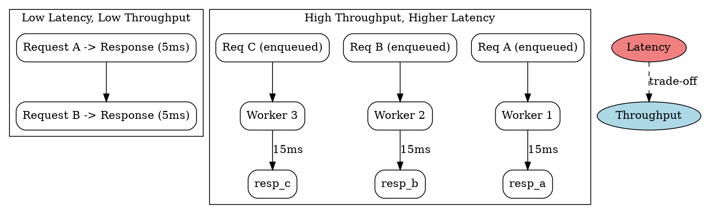

## The Problem

Low latency and high throughput are often competing goals — optimizing for one can degrade the other. Systems must balance both based on application requirements.

## Core Idea

Latency is the time taken to complete a single operation (e.g., one HTTP request). Throughput is the number of operations completed per unit time (e.g., requests per second). A system can have low latency but low throughput, or high latency but high throughput.

## How It Works

1. **Single request measurement**: Measure the time from request initiation to response completion (latency).
2. **Aggregate measurement**: Count completed requests over a fixed time window (throughput).
3. **Pipeline effect**: With a queue and multiple workers, each request's latency may increase slightly while total throughput rises significantly.
4. **Trade-off tuning**: Increasing concurrency boosts throughput up to a point, beyond which contention causes latency to spike.

## Visual Explanation

## Key Properties

- **Latency** measured in milliseconds or nanoseconds (time per operation)
- **Throughput** measured in requests per second or operations per second
- **Goal**: maximize throughput while keeping latency within acceptable bounds
- **Little's Law**: `L = λ × W` — average concurrency equals throughput times latency

## Connections

- **Related:** [[performance-vs-scalability|Performance vs Scalability]] — latency and throughput are the two dimensions of performance
- **Related:** [[back-pressure|Back Pressure]] — queue sizing affects both latency and throughput
- **Related:** [[cdn-pull|Pull CDN]] — reduces latency by serving content from edge locations
- **Related:** [[message-queues|Message Queues]] — improves throughput by decoupling producers and consumers

## Edge Cases & Gotchas

- **Tail latency matters**: Average latency hides outliers. P99 latency spikes often cause user-perceived slowness even when the average looks fine.
- **Throughput vs bandwidth**: Throughput is completed operations; bandwidth is capacity. You can have high bandwidth but low throughput due to protocol overhead or lock contention.
- **Coordinated omission**: If you exclude slow requests from measurements, reported latency looks artificially low — a common benchmarking mistake.