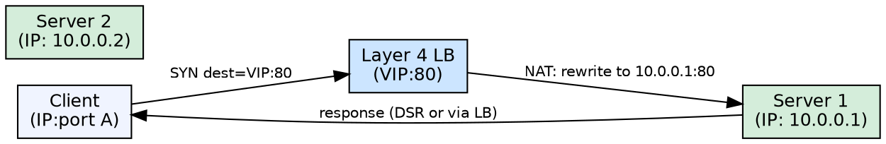

## The Problem

A single server can be overwhelmed by traffic. Requests need to be distributed across multiple servers, but inspecting application-level content is expensive and unnecessary for basic distribution.

## Core Idea

Layer 4 load balancers distribute requests using transport-layer information (source/destination IP and port) without inspecting packet contents, performing NAT to forward traffic to upstream servers.

## How It Works

1. A client makes a TCP connection to the load balancer's virtual IP.
2. The L4 LB reads the TCP/UDP header fields (source IP, dest IP, ports).
3. The LB selects a backend server using a scheduling algorithm (round robin, least connections, etc.).
4. The LB performs Network Address Translation (NAT), rewriting the destination IP/port to the selected server.
5. The server responds directly to the client (DSR mode) or through the LB.
6. The LB sees only TCP handshake and layer 4 metadata — it never decrypts or inspects the payload.

## Visual Explanation

## Key Properties

- Operates at the transport layer (TCP/UDP), never inspects payload content
- Uses Network Address Translation (NAT) to rewrite packet headers
- Lower CPU overhead per packet compared to Layer 7 load balancers
- Faster throughput on modern hardware due to simpler processing
- Supports any TCP/UDP protocol, not just HTTP

## Connections

- **Contrasts with:** [[layer7-load-balancing|Layer 7 Load Balancing]] — transport vs application layer routing tradeoffs
- **Related:** [[horizontal-scaling|Horizontal Scaling]] — L4 LB is the primary enabler of horizontal scaling
- **Related:** [[reverse-proxy-pattern|Reverse Proxy]] — both terminate and forward traffic; LB focuses on distribution
- **Related:** [[active-passive-failover|Active-Passive Failover]] — LB can detect server failure and reroute traffic

## Edge Cases & Gotchas

- L4 LB cannot route based on HTTP headers, cookies, or URL paths — all servers must be interchangeable
- Sticky sessions require client IP hashing or a separate session store since the LB cannot read cookies
- NAT rewrites break some protocols that embed IP addresses in the payload (FTP, SIP) without protocol-specific helpers

## Sources

- [[readmemd-summary|System Design Primer Summary]] — load balancing section in the Scalability chapter
