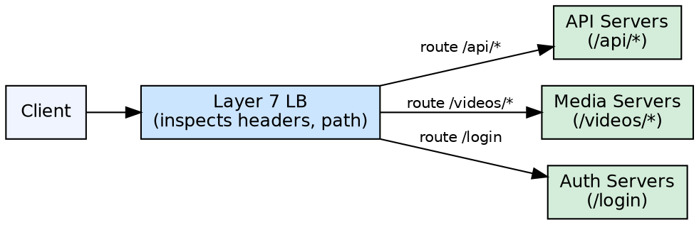

## The Problem

Not all requests are equal — some requests need different backend treatment based on their content (e.g., API version, user type, resource type). Layer 4 distribution cannot make these distinctions.

## Core Idea

Layer 7 load balancers inspect application-layer content (HTTP headers, cookies, message bodies) to make intelligent routing decisions based on request content rather than just IP and port.

## How It Works

1. The L7 LB terminates the incoming TCP connection from the client.
2. It reads the full request payload — HTTP method, URI, headers, cookies, body.
3. It makes a routing decision based on content: route `/api/v2/` to server group A, `/images/` to dedicated media servers.
4. It opens a new TCP connection to the selected backend server (or uses a keep-alive pool).
5. It forwards the request, potentially transforming headers or rewriting paths.
6. The response flows back through the LB, which may modify headers or compress content.

## Visual Explanation

## Key Properties

- Operates at the application layer (HTTP, gRPC, WebSocket)
- Inspects message content for advanced routing decisions
- More flexible routing than Layer 4 — path-based, header-based, cookie-based
- Higher CPU overhead per request due to content inspection and connection termination
- Commonly acts as a reverse proxy (e.g., Nginx, HAProxy, Envoy)

## Connections

- **Contrasts with:** [[layer4-load-balancing|Layer 4 Load Balancing]] — application vs transport layer routing
- **Related:** [[reverse-proxy-pattern|Reverse Proxy]] — L7 LB often functions as a reverse proxy with routing logic
- **Related:** [[horizontal-scaling|Horizontal Scaling]] — L7 LB enables granular scaling of individual service groups

## Edge Cases & Gotchas

- TLS termination at the LB means the LB must manage certificates, adding key management complexity
- L7 LB is slower than L4 under high load because it terminates connections and inspects payloads
- WebSocket connections require special handling — the LB must recognize the upgrade header and switch to tunnel mode