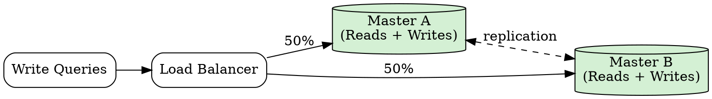

## The Problem

Master-slave replication has a single write point — if the master fails, the system cannot accept writes until a slave is promoted to master, causing write downtime.

## Core Idea

Master-master replication designates two or more database nodes as masters, each accepting both reads and writes. Masters synchronize writes between each other. If one master fails, the other continues serving both reads and writes, eliminating write downtime.

## How It Works

1. Both masters accept read and write operations from clients.
2. A load balancer distributes write traffic between masters, or application logic decides which master to write to.
3. Each write is recorded in the node's binary log and replicated to the other master(s).
4. Masters coordinate to apply each other's changes, detecting and resolving conflicting writes.
5. With two masters, conflicts are rare — with three or more, conflict resolution (last-write-wins, CRDTs, or custom merge logic) becomes necessary.
6. If one master fails, the other continues handling all traffic.

## Visual Explanation

## Key Properties

- **Multi-master writes** — any master can accept write operations
- **Both serve reads and writes** — no read-only nodes
- **Continued operation on single failure** — remaining master handles all traffic
- **Loosely consistent or higher write latency** — synchronous replication between masters adds latency; async risks divergence
- **Conflict resolution complexity** — concurrent writes to the same data on different masters must be reconciled

## Connections

- **Contrasts with:** [[master-slave-replication|Master-Slave Replication]] — multi-writer vs single-writer with read replicas
- **Related:** [[active-active-failover|Active-Active Failover]] — similar pattern where both servers handle traffic
- **Related:** [[database-federation|Database Federation]] — an alternative scaling approach that splits data by function
- **Related:** [[sharding|Sharding]] — each shard can use master-master replication for high write availability
- **Related:** [[cap-theorem|CAP Theorem]] — master-master typically favors availability and partition tolerance over strong consistency

## Edge Cases & Gotchas

- **Write conflicts** — two masters accepting concurrent writes to the same row can produce conflicting values; resolution strategies (LWW, application-merge, CRDT) each have tradeoffs.
- **Replication loops** — a write from Master A replicated to Master B may replicate back to Master A unless the system tracks which origin a change came from.
- **Higher write latency** — synchronous multi-master requires each write to be acknowledged by all masters, increasing p99 write latency significantly.

## Sources

- [[readmemd-summary|System Design Primer Summary]]
