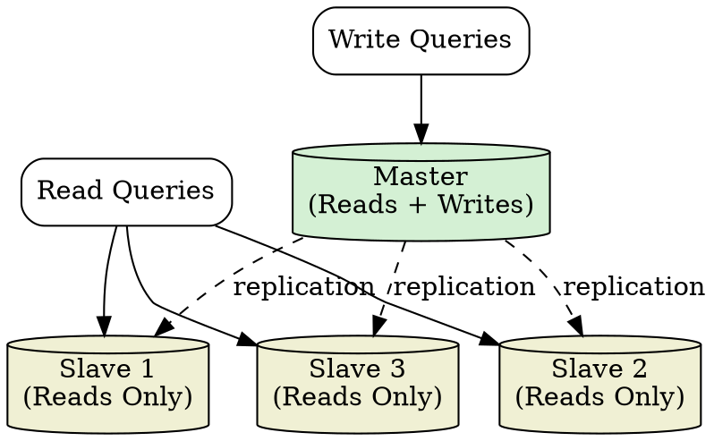

## The Problem

A single database is a single point of failure — if it goes down, the entire system loses data access. It also creates a read bottleneck: all read queries hit one server, limiting throughput.

## Core Idea

Master-slave replication designates one database as the master (handling all writes) and one or more slaves (handling read queries). The master asynchronously replicates writes to slaves. If the master fails, the system runs in read-only mode until a slave is promoted to master.

## How It Works

1. All write operations (INSERT, UPDATE, DELETE) are sent to the master database.
2. The master records the write in its binary log (binlog).
3. Slaves connect to the master and pull changes from the binlog.
4. Slaves replay the changes locally, staying eventually consistent with the master.
5. Read queries can be routed to any slave to distribute read load.
6. Slaves can chain — one slave acts as a replication source for other slaves (tree topology).
7. If the master fails, an operator or automated system promotes a slave to become the new master.

## Visual Explanation

## Key Properties

- **Single write master** — all writes go through one node, simplifying conflict resolution
- **Multiple read slaves** — read capacity scales linearly with number of slaves
- **Asynchronous replication** — slaves may lag behind the master (eventual consistency)
- **Read-only on master failure** — writes stop until a slave is promoted
- **Requires promotion logic** — automated or manual failover to elect a new master

## Connections

- **Contrasts with:** [[master-master-replication|Master-Master Replication]] — single write point vs multiple write points
- **Related:** [[active-passive-failover|Active-Passive Failover]] — similar pattern where one server is active, another stands by
- **Related:** [[strong-consistency|Strong Consistency]] — reading from the master guarantees consistency; slaves may serve stale data
- **Related:** [[sharding|Sharding]] — each shard can use master-slave replication for fault tolerance
- **Related:** [[sql-tuning|SQL Tuning]] — tuning benefits both master (write performance) and slaves (read performance)

## Edge Cases & Gotchas

- **Replication lag** — under heavy write load, slaves can fall seconds or minutes behind, serving stale data to users.
- **Split-brain on async failover** — if the old master comes back after a slave is promoted, two masters may accept writes. Use fencing or STONITH to prevent this.
- **Not all storage engines support it** — MySQL MyISAM does not support replication the same way InnoDB does; check engine compatibility.

## Sources

- [[readmemd-summary|System Design Primer Summary]]
