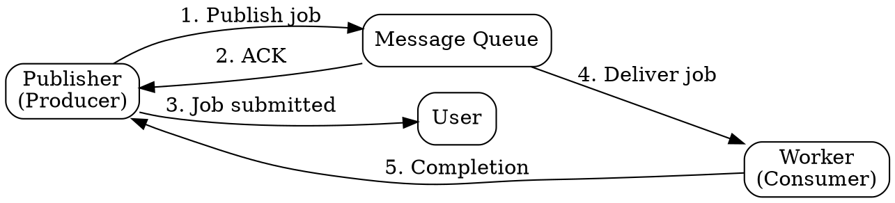

## The Problem

Synchronous execution of expensive operations blocks the user and degrades responsiveness. Direct point-to-point integration between services creates tight coupling and makes systems brittle under load spikes.

## Core Idea

Message queues receive, hold, and deliver messages asynchronously — a publisher sends a job, a worker picks it up later, and the user is not blocked. This decouples producers from consumers and provides a buffer during traffic spikes.

## How It Works

1. Application (publisher) sends a job message to the queue.
2. Queue acknowledges receipt immediately.
3. Application notifies the user of job status ("processing").
4. A worker (consumer) picks up the job from the queue.
5. Worker processes the job and signals completion.

Popular implementations: Redis (simple, high throughput, messages can be lost), RabbitMQ (AMQP, managed delivery guarantees), and SQS (fully hosted, at-least-once delivery, may deliver duplicates).

## Visual Explanation

## Key Properties

- Asynchronous processing — producers never wait for consumers
- Decouples producers and consumers (they don't need to know about each other)
- Buffers messages during traffic spikes, preventing producer overload
- Worker-based processing enables horizontal scaling of consumers
- Different reliability guarantees (at-most-once, at-least-once, exactly-once)

## Connections

- Related: [[task-queues|Task Queues]] — message queues focus on message delivery; task queues focus on scheduling and executing compute work
- Related: [[back-pressure|Back Pressure]] — queue growth beyond capacity triggers back pressure mechanisms
- Related: [[microservices-architecture|Microservices Architecture]] — queues enable loose coupling between services
- Related: [[write-behind-cache|Write-Behind Cache]] — both use async processing patterns to decouple operations

## Edge Cases & Gotchas

- **Message ordering**: Most queues do not guarantee strict FIFO ordering under high concurrency. Use a FIFO queue or sequence IDs if order matters.
- **Duplicate messages**: At-least-once delivery guarantees can result in duplicate processing. Workers should be idempotent.
- **Poison pills**: Malformed messages that cause workers to fail repeatedly can block the queue. Implement dead-letter queues to isolate them.

## Sources

- [[readmemd-summary|System Design Primer Summary]]
