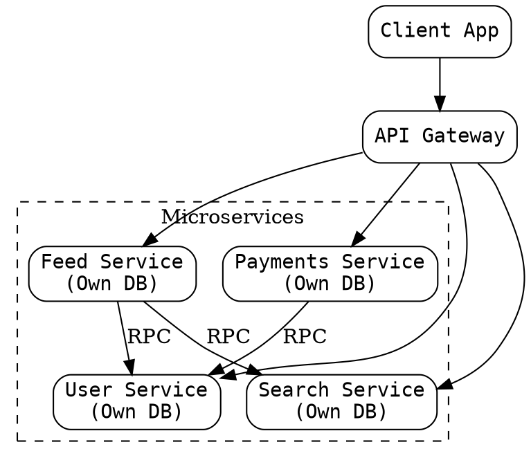

## The Problem

Monolithic applications grow too large for teams to develop, test, deploy, and scale independently. A single codebase creates coordination bottlenecks, long deployment cycles, and forces all parts of the system to use the same technology stack.

## Core Idea

Microservices architecture decomposes an application into independently deployable, small, modular services — each running its own process and communicating via lightweight mechanisms (HTTP, RPC, or message queues). Each service is built around a specific business capability and can be developed, deployed, and scaled independently.

## How It Works

1. Analyze the application domain and identify bounded contexts (e.g., user profile, feed, search, payments).
2. Create a separate service for each bounded context, each with its own codebase and data store.
3. Define service APIs (REST, gRPC, or GraphQL) for inter-service communication.
4. Deploy each service as an independent process — typically in containers.
5. Each team owns one or more services end-to-end: development, testing, deployment, and operations.
6. Services scale independently — the feed service can have 10 instances while payments runs on 2.

## Visual Explanation

## Key Properties

- **Independently deployable** — each service can be deployed without coordinating with other teams
- **Single responsibility** — each service owns one business capability
- **Polyglot technology** — services can use different languages, databases, and frameworks
- **Team autonomy** — teams own their services end-to-end
- **Isolated failure** — a crash in one service doesn't bring down the entire system

## Connections

- **Contrasts with:** monolithic architecture — a single deployable unit vs many independent services
- **Related:** [[service-discovery|Service Discovery]] — microservices need dynamic discovery to find each other's network locations
- **Related:** [[message-queues|Message Queues]] — enable asynchronous, reliable communication between services
- **Related:** [[horizontal-scaling|Horizontal Scaling]] — each service can be scaled independently based on its own load
- **Related:** [[rpc-remote-procedure-call|RPC]] — a common communication mechanism between microservices

## Edge Cases & Gotchas

- **Distributed monolith anti-pattern** — services that are tightly coupled via shared databases or chatty APIs defeat the purpose of microservices.
- **Operational complexity** — deploying 10 services is harder than deploying 1; requires container orchestration (Kubernetes), service mesh, and observability tooling.
- **Data consistency** — transactions spanning multiple services require sagas or eventual consistency; no cross-service ACID.

## Sources

- [[readmemd-summary|System Design Primer Summary]]
