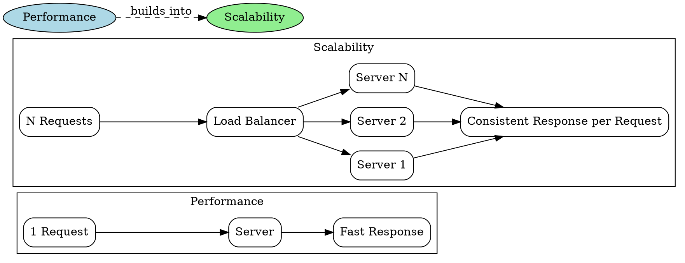

## The Problem

Engineers often use "performance" and "scalability" interchangeably, leading to incorrect architectural decisions. A system that performs well for a single user may collapse under load, while a scalable system may be individually slow.

## Core Idea

Performance measures how fast a system handles a single unit of work (response time for one request). Scalability measures how well the system maintains that performance as load increases (throughput with added resources). A system can be performant but not scalable, or scalable but not performant.

## How It Works

1. **Measure baseline**: Determine response time for a single request under minimal load (performance baseline).
2. **Increase load**: Gradually ramp up concurrent requests while monitoring response time.
3. **Identify knee point**: Observe where response time degrades significantly — the system is no longer scaling.
4. **Add resources**: Increase nodes, memory, or connections. If response time returns to baseline, the system scales horizontally.
5. **Re-evaluate**: Continue adding load until the next knee point. Diminishing returns indicate scaling limits.

## Visual Explanation

## Key Properties

- **Performance** = speed measured for a single user or request (latency and throughput)
- **Scalability** = ability to maintain performance proportionally as resources are added
- **Linear scalability** means doubling resources doubles capacity with no performance loss
- **Not interchangeable**: a Ferrari is performant (fast for one), a bus fleet is scalable (many passengers), a bus is neither

## Connections

- **Related:** [[latency-vs-throughput|Latency vs Throughput]] — both are dimensions of performance
- **Builds into:** [[horizontal-scaling|Horizontal Scaling]] — adding resources to improve scalability
- **Related:** [[cap-theorem|CAP Theorem]] — system design trade-offs affect both performance and scalability
- **Related:** [[back-of-envelope-estimates|Back-of-Envelope Estimates]] — quantifying performance expectations

## Edge Cases & Gotchas

- **Superlinear scaling**: Some systems scale better than linearly (e.g., caching clusters where more nodes reduce cache contention). This is rare and often transient.
- **Performance hides poor scalability**: A fast single node can mask the need to scale until load spikes reveal the bottleneck.
- **Amdahl's Law applies**: The serial portion of any workload caps maximum speedup, no matter how many resources are added.