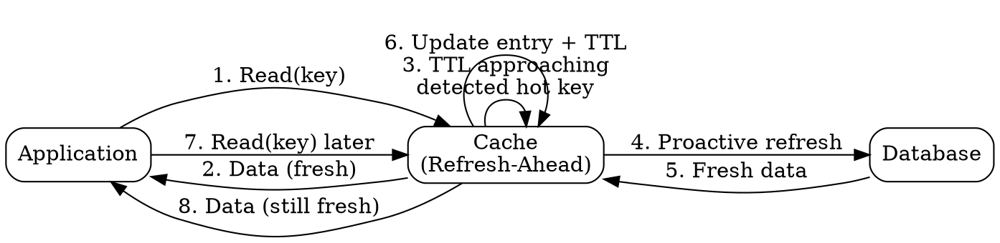

## The Problem

Cache entries expire at TTL boundaries, causing latency spikes as data must be re-fetched from the database. These spikes degrade user experience for popular entries.

## Core Idea

Refresh-ahead proactively refreshes recently accessed cache entries before they expire. By predicting which entries will be needed next, it reduces latency while keeping hot data fresh, at the cost of potentially wasting resources on incorrectly predicted entries.

## How It Works

1. Track recently accessed cache entries and their access frequency.
2. Before an entry's TTL expires, predict whether it will be accessed again.
3. If predicted to be needed, proactively re-fetch the data from the database.
4. Update the cache entry with fresh data and a new TTL, transparent to the application.
5. Result: the application almost never encounters a cold miss for popular data.

Incorrect predictions hurt performance by wasting I/O on entries that will never be accessed again.

## Visual Explanation

## Key Properties

- Proactive refresh before TTL expiry reduces access latency
- Requires accurate prediction heuristics to avoid wasted refreshes
- Can hurt performance if predictions are wrong (wasted I/O, cache churn)
- Works well with predictable, recurring access patterns
- Transparent to the application — no code changes needed on the read path

## Connections

- Contrasts with: [[cache-aside|Cache-Aside]] — proactive vs reactive caching
- Related: [[write-through-cache|Write-Through Cache]] — both proactively keep cache fresh
- Related: [[cdn-pull|Pull CDN]] — CDN pull is reactive; refresh-ahead is proactive
- Related: [[eventual-consistency|Eventual Consistency]] — refresh-ahead minimizes the window of inconsistency by keeping hot entries fresh

## Edge Cases & Gotchas

- **Wasted refreshes**: Predictions for entries that are never accessed again waste CPU and database I/O. This can degrade overall system throughput if prediction accuracy is low.
- **Cold start**: Refresh-ahead has no access history for new entries, so it cannot predict them — they will still experience a cold miss on first access.
- **Oscillation risk**: If prediction logic is too aggressive, the cache may constantly refresh entries, reducing effective TTL and increasing database load without benefit.