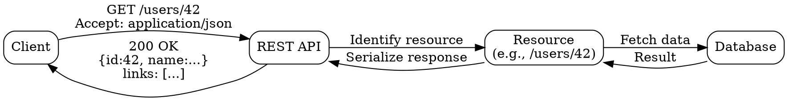

## The Problem

Tight coupling between client and server (as in RPC) makes API evolution difficult, prevents independent deployment, and complicates horizontal scaling.

## Core Idea

REST is an architectural style that enforces a client/server model where clients interact with resources through a uniform interface — URIs identify resources, HTTP verbs define actions, status codes communicate results, and HATEOAS links enable navigation. Each request is stateless and self-contained.

## How It Works

1. Resources are identified by URIs (e.g., `/users/42`).
2. Clients manipulate resources using standard HTTP verbs: GET (read), POST (create), PUT (replace), PATCH (partial update), DELETE (remove).
3. Errors are self-descriptive via HTTP status codes (200 OK, 201 Created, 400 Bad Request, 404 Not Found, 500 Internal Server Error).
4. HATEOAS (Hypermedia As The Engine Of Application State): responses include links to navigate related resources.
5. Each request is stateless — the server does not store client session context between requests.
6. Responses are cacheable via HTTP cache headers (Cache-Control, ETag).

## Visual Explanation

## Key Properties

- URI-based resource identification — everything is a resource (noun)
- HTTP verb-based actions define the uniform interface
- Stateless — each request contains all context needed to process it
- Cacheable responses reduce server load and improve latency
- Uniform interface minimizes client-server coupling

## Connections

- Contrasts with: [[rpc-remote-procedure-call|RPC]] — REST exposes data/resources (nouns); RPC exposes behaviors (verbs)
- Related: [[microservices-architecture|Microservices Architecture]] — REST APIs are a primary communication mechanism between services
- Related: [[cache-aside|Cache-Aside]] — REST supports caching via HTTP cache headers (Cache-Control, ETag)
- Related: [[layer7-load-balancing|Layer 7 Load Balancing]] — L7 load balancers can inspect and route RESTful requests based on URI paths and HTTP methods

## Edge Cases & Gotchas

- **Over-fetching / under-fetching**: REST responses return fixed resource representations, which may include unnecessary fields (over-fetching) or miss needed data (under-fetching). GraphQL or sparse fieldsets address this.
- **No standard for partial updates**: PUT replaces the entire resource; PATCH semantics vary. Clients must understand which verb and representation to use.
- **Statelessness shifts complexity**: Session state must be stored client-side or in an external store (e.g., Redis), pushing complexity out of the server.