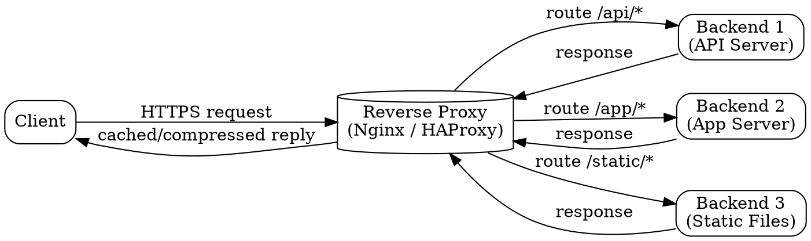

## The Problem

Backend servers should not be directly exposed to the internet for security and scalability reasons. Clients should not have to know about internal server topology, and managing SSL certificates, caching, and compression at every backend is wasteful.

## Core Idea

A reverse proxy centralizes internal services and provides a unified public interface. It forwards incoming client requests to the appropriate backend server and returns the response, acting as a single gatekeeper that handles cross-cutting concerns like SSL termination, caching, compression, and static content serving.

## How It Works

1. Client sends a request to the reverse proxy's public address (e.g., `https://api.example.com`).
2. Reverse proxy terminates the TLS connection (SSL termination), decrypting the request.
3. Proxy checks its cache — if a fresh response exists, returns it immediately.
4. If not cached, proxy forwards the request to the appropriate backend server based on URL path or host header.
5. Backend processes the request and returns the response to the proxy.
6. Proxy can compress the response (gzip), cache it, and add security headers before returning to the client.

## Visual Explanation

## Key Properties

- **Single public-facing endpoint** — all traffic arrives at one address
- **Hides backend topology** — internal server layout is never exposed to clients
- **SSL termination** — offloads certificate management and decryption from backends
- **Response caching** — serves repeated requests without contacting backends
- **Response compression** — reduces bandwidth for text-based responses

## Connections

- **Built from:** [[load-balancer|Load Balancer]] — reverse proxy often incorporates load balancing logic
- **Contrasts with:** [[layer4-load-balancing|Layer 4 Load Balancing]] — L4 LB distributes traffic at transport layer without inspecting content; RP operates at application layer
- **Related:** [[layer7-load-balancing|Layer 7 Load Balancing]] — tools like Nginx and HAProxy support both reverse proxy and L7 load balancing
- **Related:** [[cdn-push|Push CDN]] — both cache and serve static content; CDN is geographically distributed while RP is centralized
- **Related:** [[dns-system-design|DNS in System Design]] — DNS resolves the domain name to the reverse proxy's IP address

## Edge Cases & Gotchas

- **Single point of failure** — if the reverse proxy goes down, the entire service is unreachable; always deploy at least two in an active-passive or active-active configuration.
- **Request buffering** — large uploads can exhaust proxy memory; configure request size limits or stream directly to backends.
- **Latency overhead** — every request passes through an extra hop; this is negligible in most cases but matters for ultra-low-latency systems.