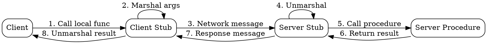

## The Problem

Network communication between services requires manual serialization, addressing, protocol handling, and error management — this is complex, error-prone, and obscures business logic.

## Core Idea

RPC makes a remote procedure call look indistinguishable from a local call. The client calls a local stub that marshals the function name and arguments into a network message, sends it to the server, which unmarshals and executes the function, and returns the result — all transparent to the application code.

## How It Works

1. Client calls a local stub function as if it were a local procedure.
2. The client stub marshals the procedure ID and arguments into a binary or structured message.
3. The client OS sends the message over the network to the server.
4. The server OS passes the message to the server stub.
5. The server stub unmarshals the message, locates and calls the actual procedure.
6. The procedure executes and returns a result to the server stub.
7. The response follows the reverse path back to the client.

Popular RPC frameworks include Protocol Buffers (gRPC), Apache Thrift, and Apache Avro.

## Visual Explanation

## Key Properties

- Hides network complexity behind a familiar local-call abstraction
- Request-response protocol — synchronous by default
- Automatically marshals/unmarshals parameters and return values
- Tight client-server coupling (interface contract is shared)
- Better suited for internal service-to-service communication than public APIs

## Connections

- Contrasts with: [[rest-architectural-style|REST]] — RPC exposes behaviors (functions); REST exposes resources (nouns)
- Related: [[microservices-architecture|Microservices Architecture]] — RPC is a common inter-service communication pattern
- Related: [[service-discovery|Service Discovery]] — RPC clients need to locate server instances dynamically
- Related: [[message-queues|Message Queues]] — RPC is synchronous; message queues enable async communication

## Edge Cases & Gotchas

- **Network failures are invisible**: The local-call abstraction hides network partitions, timeouts, and partial failures. RPC calls can fail silently or hang.
- **Versioning hell**: Evolving the interface contract requires coordinated deployment of both client and server. Use schema evolution features (e.g., Protobuf field tags) to mitigate.
- **Performance overhead**: Marshaling, network round-trips, and connection management add latency compared to in-process calls. Batch calls or use streaming for high-throughput scenarios.