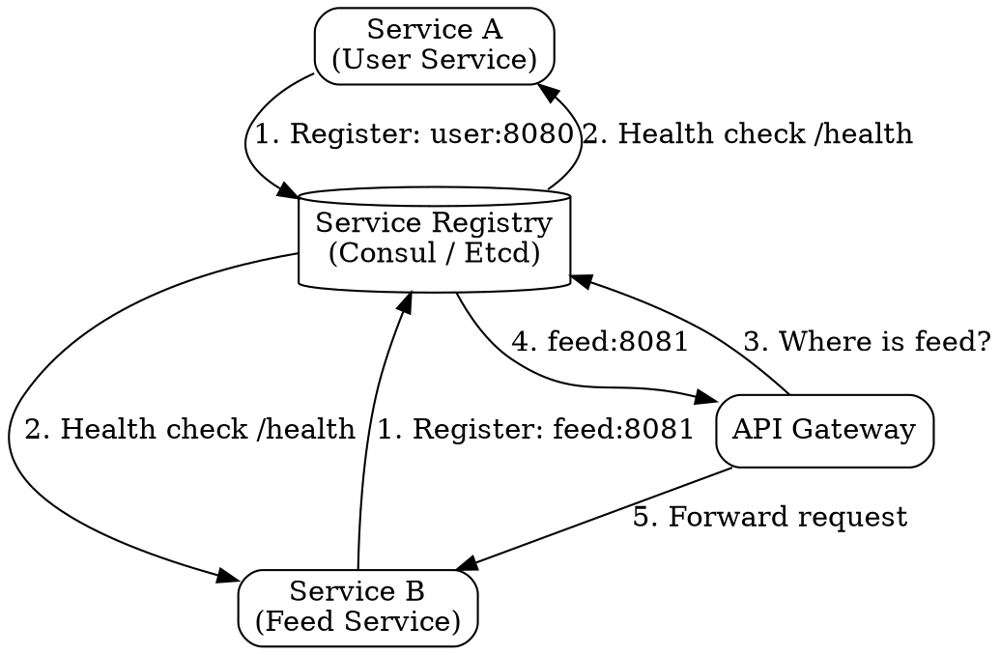

## The Problem

In dynamic microservice environments, IP addresses and ports change frequently as instances are created, destroyed, or moved during scaling events and failures. Hard-coding addresses makes the system brittle and unmanageable.

## Core Idea

Service discovery tools (Consul, Etcd, Zookeeper) maintain a registry of service names mapped to their current network locations (IP + port). Services register themselves on startup and the registry performs health checks to remove unhealthy instances, allowing clients to always find live services.

## How It Works

1. On startup, each service instance registers its name, IP address, and port with the discovery service.
2. The discovery service runs periodic health checks (e.g., HTTP `/health` endpoint) against registered instances.
3. Unhealthy instances that fail health checks are automatically deregistered.
4. When a service (or API gateway) needs to call another service, it queries the registry for the service name.
5. The registry returns the list of healthy instances, and the client picks one (round-robin, random, or least-loaded).
6. The key-value store in the registry can hold shared configuration values (feature flags, DB URLs).

## Visual Explanation

## Key Properties

- **Dynamic registration/deregistration** — instances automatically register on startup and deregister on shutdown
- **Health checks** — continuous verification that instances are alive and ready
- **Key-value store** — shared configuration storage alongside the registry
- **Consistent naming** — services are found by logical name, not physical address

## Connections

- **Built from:** [[microservices-architecture|Microservices Architecture]] — dynamic microservice environments create the need for discovery
- **Related:** [[layer7-load-balancing|Layer 7 Load Balancing]] — L7 load balancers use the service registry to discover healthy backends
- **Related:** [[horizontal-scaling|Horizontal Scaling]] — scaling up/down changes instance counts, and discovery tracks the current set
- **Related:** [[message-queues|Message Queues]] — an alternative async communication pattern that decouples services without direct discovery
- **Related:** [[reverse-proxy-pattern|Reverse Proxy Pattern]] — reverse proxy can use service discovery to route to backends

## Edge Cases & Gotchas

- **Cached stale entries** — if a service crashes without deregistering, the registry may return a dead instance until the next health check.
- **Thundering herd on registry** — if every client aggressively re-queries on failure, the registry can be overwhelmed; client-side caching with TTL is essential.
- **Consistency vs. availability tradeoff** — highly available registries (eventually consistent) may return stale data; strongly consistent registries (Paxos/Raft based) add write latency.