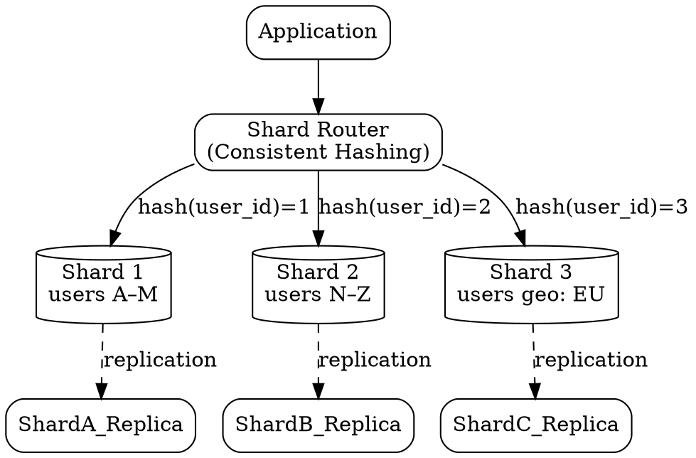

## The Problem

As data grows, a single database becomes too slow — indexes grow too large to fit in memory, write throughput plateaus, and backup/recovery times become dangerously long.

## Core Idea

Sharding distributes data across multiple databases such that each database (shard) manages a subset of the data, reducing per-shard read/write traffic, shrinking index sizes, and allowing the system to scale horizontally by adding more shards.

## How It Works

1. Choose a shard key — an attribute that determines data placement (e.g., user ID, geographic region, last name initial).
2. Define a sharding strategy: range-based (A–M on shard 1, N–Z on shard 2), hash-based (hash(user_id) % N), or directory-based (lookup table).
3. Each shard is an independent database with its own subset of data.
4. Queries include the shard key so the application or proxy routes them to the correct shard.
5. Add more shards as data grows — consistent hashing minimizes data movement during rebalancing.

## Visual Explanation

## Key Properties

- **Data distributed by key** — each shard holds a non-overlapping subset
- **Less traffic per shard** — read/write load is divided by the number of shards
- **Smaller indexes** — each shard's index fits in memory, speeding queries
- **Failure isolation** — a failure in one shard doesn't affect other shards
- **No single write serialization point** — multiple shards accept writes in parallel

## Connections

- **Related:** [[database-federation|Database Federation]] — federation splits by function, sharding splits by key (complementary strategies)
- **Related:** [[denormalization|Denormalization]] — reduces need for cross-shard joins by duplicating data
- **Related:** [[horizontal-scaling|Horizontal Scaling]] — sharding is the database equivalent of horizontal scaling
- **Related:** [[master-slave-replication|Master-Slave Replication]] — each shard can have its own replication topology for fault tolerance
- **Related:** [[consistent-hashing|Consistent Hashing]] — a key algorithm for minimizing data movement when adding/removing shards

## Edge Cases & Gotchas

- **Resharding complexity** — adding a new shard with a naive hash(N) strategy requires reshuffling most data; consistent hashing reduces but doesn't eliminate this.
- **Skewed shards** — if the shard key is poorly chosen, one shard may get 80% of traffic while others sit idle.
- **Cross-shard queries** — operations that span multiple shards require scatter-gather (query all shards and merge results), which is slow and complex.