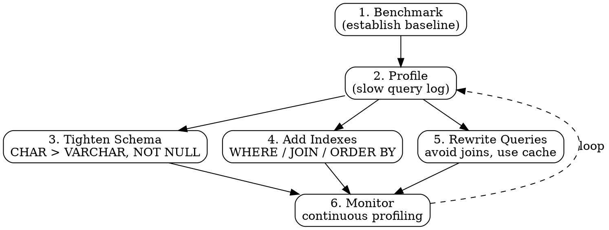

## The Problem

Poorly written SQL queries can be 100–1000x slower than optimized alternatives. Without benchmarking and profiling, development teams deploy queries that waste database CPU, memory, and I/O — degrading system performance for all users.

## Core Idea

SQL tuning is the practice of optimizing schema design, indexing, and query structure to improve database performance. The process follows: benchmark (establish baseline), profile (identify slow queries with tools like the slow query log), and optimize (tighten schema, add indexes, rewrite queries).

## How It Works

1. **Benchmark** — use tools like `ab` or `sysbench` to establish baseline query performance.
2. **Profile** — enable the slow query log to identify queries that exceed a threshold (e.g., 100ms).
3. **Tighten schema** — use `CHAR` instead of `VARCHAR` for fixed-length fields, `INT` for numbers, `DECIMAL` for currency, `TEXT` for large blobs, and add `NOT NULL` where possible to improve search performance.
4. **Add indexes** — index columns used in `WHERE`, `ORDER BY`, `GROUP BY`, and `JOIN` clauses; use B-tree indexes for sorted access.
5. **Avoid expensive joins** — denormalize hot paths; partition very large tables; use query cache for repeated reads.
6. **Monitor** — continuously profile to catch regressions after schema or code changes.

## Visual Explanation

## Key Properties

- **Benchmark then profile** — always measure before optimizing; don't guess at bottlenecks
- **Index WHERE/GROUP BY/ORDER BY/JOIN columns** — these are the primary targets for index optimization
- **CHAR is faster than VARCHAR** — fixed-width fields avoid length-prefix overhead; use for codes, enums, fixed identifiers
- **NOT NULL improves search performance** — nullable columns require extra checks per row
- **Index updates slow writes** — each index must be updated on INSERT/UPDATE; balance read vs write needs

## Connections

- **Related:** [[denormalization|Denormalization]] — a specific SQL tuning technique that trades write speed for read speed
- **Related:** [[master-slave-replication|Master-Slave Replication]] — tuning benefits both masters (write-heavy) and slaves (read-heavy) differently
- **Related:** [[nosql-database-types|NoSQL Database Types]] — some tuning concerns (schema design, joins) are avoided by moving to NoSQL
- **Related:** [[cache-aside|Cache-Aside]] — caching reduces database load, complementing SQL tuning efforts
- **Related:** [[sharding|Sharding]] — sharding reduces per-node data volume, which directly improves query performance

## Edge Cases & Gotchas

- **Premature optimization** — tuning queries that run once a day for 200ms is a waste of effort; profile first to find the real bottlenecks.
- **Index overkill** — too many indexes slow down writes significantly and increase disk usage; a table with 10 indexes on 1M rows can see 3x slower inserts.
- **Query cache invalidation** — MySQL query cache is invalidated on every write to the table; on write-heavy tables, the cache does more harm than good.

## Sources

- [[readmemd-summary|System Design Primer Summary]]
