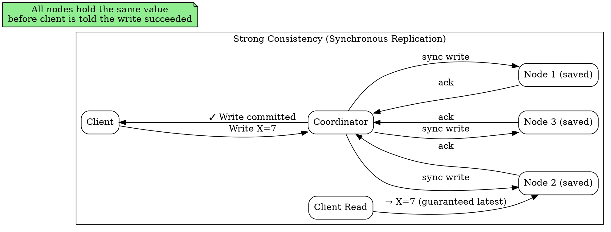

## The Problem

Many applications — banking, inventory management, distributed locking — cannot tolerate reading stale data. A user who transfers money should see the updated balance on refresh.

## Core Idea

Strong consistency guarantees that after a write completes, all subsequent reads (from any node) will return that write's value. This is achieved through synchronous replication: a write is not acknowledged to the client until a quorum of nodes confirms they have persisted it. The system behaves as if there is a single copy of the data, regardless of replication factor.

## How It Works

1. **Client issues write**: The write request is sent to a coordinator node.
2. **Synchronous replication**: The coordinator sends the write to all replicas and waits for acknowledgment from a quorum (e.g., majority).
3. **Acknowledge to client**: Once the quorum acknowledges, the client receives confirmation. All future reads, regardless of which node they hit, will see this value.
4. **Read follows same path**: Reads may also require quorum to ensure they see the latest value, or they may go through the primary node (which always has the latest write).

## Visual Explanation

## Key Properties

- **All reads see the latest write** — behaves like a single-node system
- **Synchronous replication** — writes are committed to a quorum before acknowledgment
- **Higher latency** than weak or eventual consistency (waiting for slowest quorum member)
- **Used in RDBMS (primary reads), ZooKeeper (atomic broadcast), and file systems (NFS, GFS metadata)**

## Connections

- **Contrasts with:** [[eventual-consistency|Eventual Consistency]] — sync vs async replication, immediate guarantees vs eventual convergence
- **Contrasts with:** [[weak-consistency|Weak Consistency]] — deterministic guarantees vs no guarantees at all
- **Related:** [[cp-consistency-partition-tolerance|CP — Consistency and Partition Tolerance]] — CP systems guarantee strong consistency during normal operation
- **Related:** [[master-slave-replication|Master-Slave Replication]] — reading from the master provides strong consistency; slaves may lag

## Edge Cases & Gotchas

- **Performance cliff under contention**: Strong consistency requires global ordering of writes. Under high contention, this serialization becomes a bottleneck and throughput collapses.
- **Not truly linearizable in practice**: Many systems advertise strong consistency but use clock-based ordering, which can fail under clock skew. True linearizability (e.g., Spanner's TrueTime) is rare and expensive.
- **Multi-region cost**: Synchronous replication across geographic regions is extremely slow (speed of light latency). Global strong consistency is impractical for most systems — multi-master or eventual consistency is preferred.

## Sources

- [[readmemd-summary|System Design Primer Summary]]
