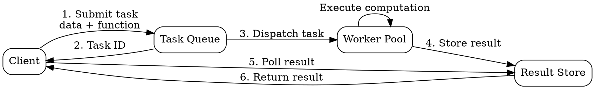

## The Problem

Computationally intensive or time-based background jobs (image processing, report generation, batch operations) need scheduling, execution management, and result delivery that message queues alone do not provide.

## Core Idea

Task queues receive tasks with their related data, schedule and execute them on worker processes, and deliver results back to the caller. They extend message queue concepts with scheduling, retries, and result tracking for compute-heavy workloads.

## How It Works

1. Client submits a task (function + parameters) to the queue.
2. Queue schedules the task for execution (immediately or at a future time).
3. A worker picks up the task and executes the computation.
4. Worker stores the result or delivers it back to the client.
5. If the task fails, the queue can retry according to configured policies.

Celery (Python) is a popular task queue framework with support for periodic scheduling, result backends, and multiple message broker backends (Redis, RabbitMQ).

## Visual Explanation

## Key Properties

- Schedules and executes computational tasks (not just message passing)
- Supports scheduled/delayed execution (cron-like scheduling)
- Returns results to the caller via a result backend
- Built-in retry and error handling for failed tasks
- Well-suited for CPU-intensive or long-running background work

## Connections

- Related: [[message-queues|Message Queues]] — task queues extend message queue concepts with scheduling and result tracking
- Related: [[back-pressure|Back Pressure]] — prevents task queue overflow under heavy submission
- Related: [[microservices-architecture|Microservices Architecture]] — background processing offloads work from request path
- Contrasts with: synchronous processing — async background computation vs inline blocking execution

## Edge Cases & Gotchas

- **Task idempotency**: Retries can cause duplicate execution. Design tasks to be idempotent or use a deduplication mechanism.
- **Worker death**: If a worker dies mid-task, the task is lost or stuck. Use task acknowledgements and visibility timeouts to re-queue.
- **Task starvation**: Long-running tasks can block workers from picking up short tasks. Use separate queues or priority queues to mitigate.

## Sources

- [[readmemd-summary|System Design Primer Summary]]
