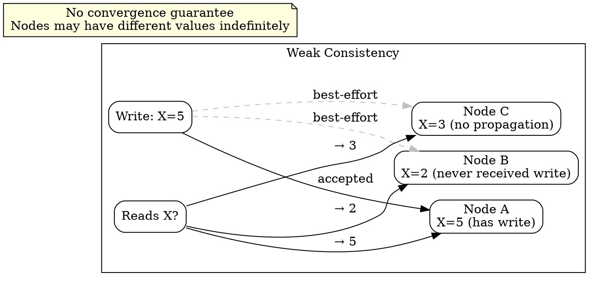

## The Problem

Strong consistency has performance costs that some real-time applications cannot afford. Applications like VoIP, video chat, and multiplayer games need minimal latency above all else.

## Core Idea

After a write, subsequent reads may or may not see it — there is no guarantee whatsoever. Weak consistency is a best-effort approach that prioritizes low latency over any read-after-write guarantee. Unlike eventual consistency, there is no promise that replicas will ever converge to the same state.

## How It Works

1. **Client writes**: The write is accepted by the nearest or fastest-responding node.
2. **Best-effort propagation**: The write is broadcast to other nodes with no acknowledgment or ordering guarantees.
3. **Reads return local state**: Each read returns whatever the responding node has locally — potentially stale, potentially newer, potentially conflicting.
4. **No convergence contract**: Unlike eventual consistency, there is no guarantee that all nodes will eventually hold the same value. If propagation is interrupted, divergence persists.

## Visual Explanation

## Key Properties

- **No guarantee** that a write will ever be visible to a subsequent read
- **Lowest latency** of any consistency model — no coordination overhead
- **Best-effort approach** — propagation happens but is not enforced
- **Common in VoIP, video chat, realtime multiplayer games** where timing matters more than data accuracy

## Connections

- **Contrasts with:** [[strong-consistency|Strong Consistency]] — weak gives no guarantees, strong guarantees the latest write is always visible
- **Contrasts with:** [[eventual-consistency|Eventual Consistency]] — weak may never converge, eventual guarantees convergence given enough time
- **Related:** [[ap-availability-partition-tolerance|AP — Availability and Partition Tolerance]] — weak consistency prioritizes availability above all
- **Related:** [[cache-aside|Cache-Aside]] — cache-aside exhibits weak consistency between cache and database by design

## Edge Cases & Gotchas

- **Write loss**: If a node accepts a write and crashes before propagating it, that write may be lost entirely.
- **Not a good default**: Weak consistency is a deliberate trade-off for extreme performance requirements. Using it accidentally (e.g., misconfigured replication) leads to data loss and hard-to-debug heisenbugs.
- **Hard to test**: Since behavior is non-deterministic, weak consistency bugs are notoriously difficult to reproduce in test environments.

## Sources

- [[readmemd-summary|System Design Primer Summary]]
