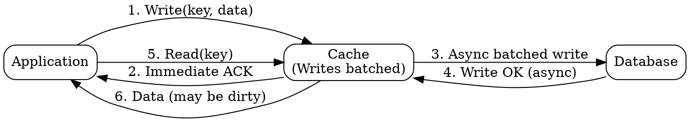
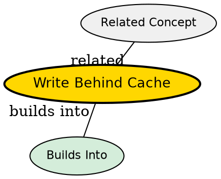

## The Problem

Synchronous writes (write-through) add database write latency to every write operation, reducing throughput for write-heavy workloads.

## Core Idea

Write-behind (write-back) cache acknowledges the write to the application immediately and asynchronously persists the data to the database. This decouples write latency from database performance, dramatically improving throughput at the cost of potential data loss if the cache fails before the DB write completes.

## How It Works

1. Application adds or updates an entry in the cache.
2. Cache immediately acknowledges success to the application.
3. Cache asynchronously batches and writes data to the database in the background.
4. The cache may coalesce multiple updates to the same key into a single DB write.

Write performance is greatly improved, but the window between cache acknowledgement and DB persistence creates a risk of data loss.

## Visual Explanation

## Key Properties

- Asynchronous writes decouple application latency from database performance
- Risk of data loss if the cache fails before the DB write completes
- More complex to implement than write-through (needs durability guarantees)
- Ideal for write-heavy workloads that can tolerate temporary inconsistency
- Can batch and coalesce writes for better DB efficiency

## Semantic Network

## Connections

- Contrasts with: [[cache-aside|Cache-Aside]] -- app initiates vs cache initiates DB write
- Contrasts with: [[write-through-cache|Write-Through Cache]] -- async vs sync DB write
- Related: [[message-queues|Message Queues]] -- similar async processing and buffering pattern
- Related: [[eventual-consistency|Eventual Consistency]] -- write-behind creates a window of temporary inconsistency

## Edge Cases & Gotchas

- **Data loss on cache failure**: If the cache node crashes before flushing writes to the database, unpersisted data is lost. Requires replication or persistent caching layers to mitigate.
- **Inconsistency window**: Readers may see data in the cache that hasn't yet been written to the database. Downstream systems querying the DB directly will not see the update.
- **Write ordering**: If the cache reorders or coalesces writes, the database may receive updates in a different order than the application issued them.