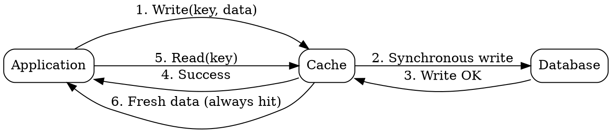

## The Problem

Cache-aside can return stale data when the database is updated directly, bypassing the cache. Applications must manually invalidate or update cached entries after DB writes.

## Core Idea

Write-through cache treats the cache as the authoritative data store for writes — every write goes to the cache first, then the cache synchronously writes to the database. This ensures the cache always has the latest data at the cost of slower write operations.

## How It Works

1. Application writes or updates an entry in the cache.
2. The cache synchronously writes the data to the database.
3. Only after both writes complete does the cache return success.
4. Reads of recently written data are fast (served from cache).
5. Cache always has the latest data — no staleness window.

This pattern is often combined with cache-aside for reads on new cache nodes that haven't been populated yet.

## Visual Explanation

## Key Properties

- Cache writes are synchronous — the database write completes before returning
- Data in the cache is never stale (for entries updated through the cache)
- Write operations are slower than cache-aside (two sequential writes)
- Reads of recently written data are fast (always a cache hit)
- Often combined with cache-aside for populating new cache nodes

## Connections

- Contrasts with: [[cache-aside|Cache-Aside]] — app manages cache vs cache manages DB writes
- Contrasts with: [[write-behind-cache|Write-Behind Cache]] — sync vs async DB write
- Related: [[refresh-ahead-cache|Refresh-Ahead Cache]] — both keep cache fresh but with different triggers
- Related: [[strong-consistency|Strong Consistency]] — write-through ensures cache is consistent with the database

## Edge Cases & Gotchas

- **Write amplification**: Every write hits both cache and DB, doubling write operations compared to a direct DB write.
- **No stale-data protection for direct DB writes**: If another process writes directly to the database (bypassing the cache), the cache still becomes stale.
- **Higher write latency**: The client blocks until both cache and DB acknowledge, making writes slower than write-behind or cache-aside.