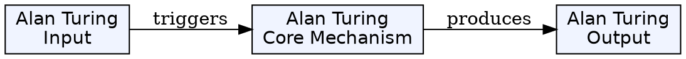
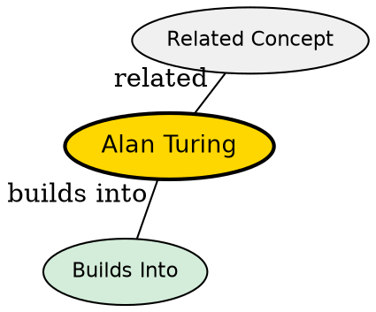

## The Problem

How do we formally define computability and build the theoretical foundation for all computers?

## Core Idea

Alan Turing (1912-1954) was a British mathematician and computer scientist who created the Turing machine model, proved the halting problem undecidable, and contributed to codebreaking during WWII.

## How It Works

Key contributions:

- **1936**: Published "On Computable Numbers" introducing the Turing machine
- **1937**: Proved the halting problem is undecidable
- **1939-1945**: Led Hut 8 at Bletchley Park, breaking the Enigma code
- **1950**: Created the Turing test for machine intelligence

The Turing machine became the standard model for computability theory.

## Key Properties

- Founded computability theory
- Created the Turing machine model
- Proved fundamental undecidability results
- Pioneer of artificial intelligence
- Short life ended tragically in 1954

## Visual Explanation

## Semantic Network

## Connections

- Built from: [[turing-machine|Turing Machine]]
- Builds into: [[computability-theory|Computability Theory]], [[halting-problem|Halting Problem]], [[artificial-intelligence|Artificial Intelligence]]
- Related: [[alonzo-church|Alonzo Church]], [[church-turing-thesis|Church-Turing Thesis]]
## Why This Matters

Turing's work defined what computation means. His machine model is the foundation of computer science, and his ideas about machine intelligence continue to shape AI today.