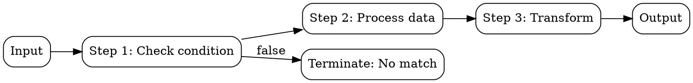

## The Problem
Before formal computation theory, there was no precise definition of what it means to "compute" something. Informal notions of "effective procedure" or "mechanical process" were insufficient for proving fundamental limits.

## Core Idea
An algorithm is a finite, unambiguous, step-by-step procedure for solving a problem or computing a function. It must terminate after a finite number of steps for all valid inputs.

## How It Works
Algorithms have these key characteristics (from Church-Turing thesis):
1. **Finiteness** — algorithm has finite description, terminates for all inputs
2. **Definiteness** — each step is precisely defined, no ambiguity
3. **Input** — zero or more inputs from a specified set
4. **Output** — at least one output that is the solution to the problem
5. **Effectiveness** — each operation must be basic enough to be done exactly and in finite time

Algorithms can be expressed in many forms: pseudocode, programming languages, Turing machines, lambda calculus expressions, or flowcharts.

## Visual Explanation

## Key Properties
- **Correctness** — produces right output for all valid inputs
- **Termination** — halts after finite steps (unlike infinite loops)
- **Complexity** — time and space requirements as function of input size
- **Determinism** — same input always produces same output (for deterministic algorithms)

## Connections
- Built from: [[mathematical-logic|Mathematical Logic]] — formal reasoning about procedures
- Builds into: [[turing-machine|Turing Machine]] — formal model of algorithmic computation
- Builds into: [[computability-theory|Computability Theory]] — what algorithms can/cannot compute
- Builds into: [[computational-complexity-theory|Computational Complexity Theory]] — resources required by algorithms
- Related: [[big-o-notation|Big O Notation]] — measuring algorithm efficiency
- Contrasts with: [[heuristic|Heuristic]] — rules of thumb vs guaranteed procedures

## Edge Cases & Gotchas
- Not all procedures are algorithms — must terminate (halting problem shows some procedures don't)
- Algorithm ≠ program — algorithms are abstract, programs are concrete implementations
- Nondeterministic algorithms allow "guessing" — basis for NP complexity class