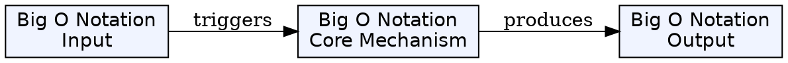
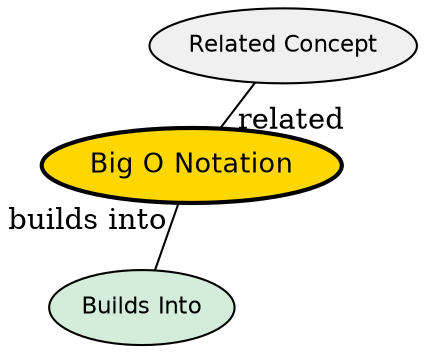

## The Problem

How do we compare algorithm efficiency without being tied to specific hardware or machine details?

## Core Idea

Big O notation describes the upper bound on the growth rate of a function, allowing comparison of algorithms based on how their resource requirements scale with input size, ignoring machine-dependent constants.

## How It Works

Big O describes asymptotic behavior as input grows large:

- O(1) - constant time
- O(log n) - logarithmic time
- O(n) - linear time
- O(n²) - quadratic time
- O(2^n) - exponential time

The notation focuses on dominant terms, ignoring lower-order terms and constants.

## Key Properties

- Describes upper bound (worst-case growth)
- Ignores machine-specific constants
- Focuses on asymptotic behavior
- Used for time and space complexity
- Essential for comparing algorithms

## Visual Explanation

## Semantic Network

## Connections

- Built from: [[asymptotic-analysis|Asymptotic Analysis]]
- Builds into: [[computational-complexity-theory|Computational Complexity Theory]], [[time-complexity|Time Complexity]], [[space-complexity|Space Complexity]]
- Related: [[algorithm|Algorithm]], [[big-omega-notation|Big Ω Notation]], [[big-theta-notation|Big Θ Notation]]

## Edge Cases & Gotchas

- Big O gives upper bound--actual performance may be better
- Constants matter in practice for small inputs
- Must consider best, average, and worst case