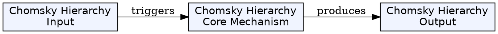
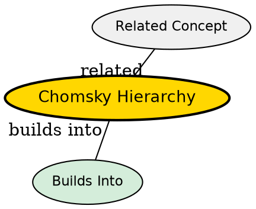

## The Problem

How are formal languages classified by their computational power?

## Core Idea

The Chomsky hierarchy is a classification of formal languages into four types (Type 0-3), where each type is defined by the complexity of grammar required to generate it and corresponds to a class of automata that can recognize it.

## How It Works

The hierarchy (from most to least powerful):

- **Type 0 (Unrestricted)** - Recursively enumerable languages, recognized by Turing machines
- **Type 1 (Context-sensitive)** - Recognized by linear-bounded Turing machines
- **Type 2 (Context-free)** - Recognized by pushdown automata
- **Type 3 (Regular)** - Recognized by finite automata

Each type is a proper subset of the previous type, creating nested inclusions.

## Key Properties

- Four types (Type 0-3) with increasing restrictions
- Each type corresponds to a class of automata
- Type 0 ⊇ Type 1 ⊇ Type 2 ⊇ Type 3
- Proposed by Noam Chomsky in 1956
- Used to understand language complexity and computational power

## Visual Explanation

## Semantic Network

## Connections

- Built from: [[formal-language-theory|Formal Language Theory]], [[grammar|Grammar]]
- Builds into: [[regular-grammar|Regular Grammar]], [[context-free-grammar|Context-Free Grammar]]
- Related: [[finite-automaton|Finite Automaton]], [[pushdown-automaton|Pushdown Automaton]], [[turing-machine|Turing Machine]]

## Edge Cases & Gotchas

- Higher in the hierarchy means more powerful but more complex to process
- Regular languages are efficient but limited in what they can express