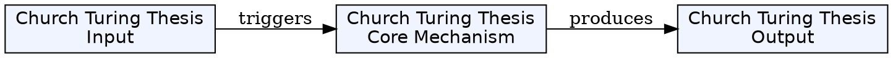
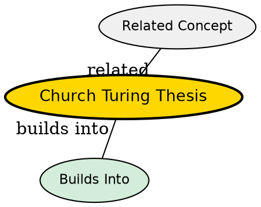

## The Problem

What does it mean for a function to be "computable"? Is there a single definition that captures all intuitive notions of computability?

## Core Idea

The Church-Turing thesis states that Turing machines capture the notion of computability--any function that can be intuitively computed can be computed by a Turing machine. It is a thesis, not a theorem, because it equates an intuitive notion with a formal definition.

## How It Works

The thesis unifies multiple independent definitions of computability:

- Turing machine computability
- Lambda calculus definability
- μ-recursive function computability
- Register machine computability

All have been proven equivalent, strengthening confidence in the thesis.

## Key Properties

- Equates intuitive "effectively computable" with formal Turing-computable
- Not proven (it's a thesis), but widely accepted
- Multiple equivalent formalizations
- Fundamental to computability theory

## Visual Explanation

## Semantic Network

## Connections

- Built from: [[turing-machine|Turing Machine]], [[lambda-calculus|Lambda Calculus]], [[mu-recursive-functions|μ-Recursive Functions]]
- Builds into: [[computability-theory|Computability Theory]]
- Related: [[model-of-computation|Model of Computation]]

## Edge Cases & Gotchas

- The thesis is not provable because "intuitively computable" is not formally defined
- Some models (like oracles) can compute beyond Turing machines--but these aren't "ordinary" computation
## Why This Matters

The Church-Turing thesis defines what we mean by "computable." When we say a problem is unsolvable, we mean unsolvable by a Turing machine--which means unsolvable by any algorithm.