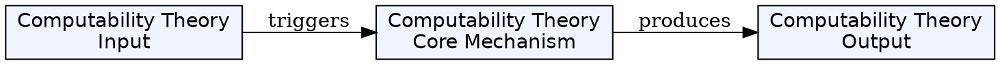
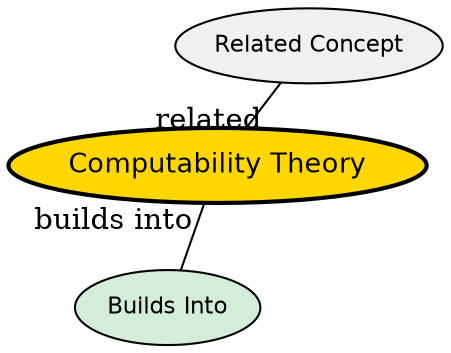

## The Problem

Which problems can be solved by a computer at all, regardless of how long it takes?

## Core Idea

Computability theory (also called recursion theory) deals with the question of whether a problem is solvable on a computer. It determines the boundaries of what algorithms can achieve.

## How It Works

The field builds on fundamental results:

- **Halting problem** - cannot be solved by any algorithm
- **Rice's theorem** - all non-trivial properties of partial functions are undecidable
- Uses Turing machines as the primary model

Computability theory is closely related to mathematical logic's recursion theory, which removes the restriction of studying only models reducible to Turing machines.

## Key Properties

- Studies which problems are solvable
- Uses Turing machine as standard model
- Major result: halting problem is undecidable
- Builds on the halting problem result
- Often synonymous with recursion theory

## Visual Explanation

## Semantic Network

## Connections

- Built from: [[turing-machine|Turing Machine]], [[halting-problem|Halting Problem]], [[rices-theorem|Rice's Theorem]]
- Builds into: [[computational-complexity-theory|Computational Complexity Theory]]
- Related: [[mathematical-logic|Mathematical Logic]], [[recursion-theory|Recursion Theory]], [[model-of-computation|Model of Computation]]

## Edge Cases & Gotchas

- "Undecidable" means no algorithm exists--not just that no one has found one
- Some problems are undecidable even though individual instances may be solvable
## Why This Matters

Computability theory defines the fundamental limits of what computers can do. Knowing a problem is undecidable saves time trying to find a solution that doesn't exist.