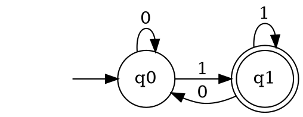

## The Problem
We need a formal mathematical model to describe what patterns a computer can recognize. Regular expressions and simple pattern matching need a computational model that's simpler than Turing machines but still useful.

## Core Idea
A finite automaton is the simplest computational model — a mathematical abstraction of a machine with a finite number of states that reads input symbols and transitions between states. It recognizes regular languages (Type-3 in Chomsky hierarchy).

## How It Works
A finite automaton consists of:
1. **Finite set of states** — Q (one is start state, some are accept/final states)
2. **Alphabet** — Σ, the set of input symbols
3. **Transition function** — δ: Q × Σ → Q (deterministic) or δ: Q × Σ → P(Q) (nondeterministic)
4. **Start state** — where computation begins
5. **Accept states** — successful computation ends here

The automaton reads input left-to-right, one symbol at a time, following transitions. If it ends in an accept state, the input is accepted.

## Visual Explanation

## Key Properties
- **Deterministic (DFA)** — exactly one transition per state-symbol pair
- **Nondeterministic (NFA)** — multiple possible transitions; can "guess" correctly
- **Equivalence** — DFAs and NFAs recognize the same languages (regular languages)
- **Limited memory** — only current state matters, no auxiliary memory
- **Pumping lemma** — can prove languages are NOT regular

## Connections
- Built from: [[automata-theory|Automata Theory]] — finite automata are the simplest automata
- Builds into: [[turing-machine|Turing Machine]] — adds infinite tape for more power
- Builds into: [[chomsky-hierarchy|Chomsky Hierarchy]] — Type-3 (regular) languages
- Related: [[formal-language-theory|Formal Language Theory]] — regular languages and regex
- Contrasts with: [[pushdown-automaton|Pushdown Automaton]] — adds stack, more powerful

## Edge Cases & Gotchas
- Can't count arbitrarily (e.g., can't recognize aⁿbⁿ for arbitrary n)
- NFAs can be converted to DFAs (but may require exponentially more states)
- Regular expressions in programming are often MORE powerful than formal regular languages