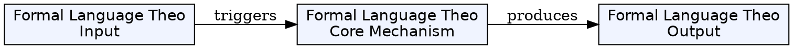
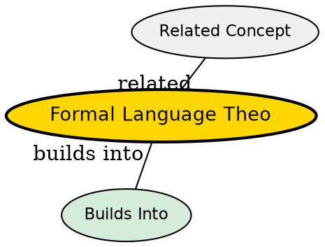

## The Problem

How do we mathematically describe and classify sets of strings (languages)?

## Core Idea

Formal language theory is a branch of mathematics concerned with describing languages as sets of operations over an alphabet. It provides the mathematical foundation for specifying what strings are valid in a language.

## How It Works

A formal language consists of:

- An **alphabet** - finite set of symbols
- A set of **strings** (or words) formed from those symbols
- Formal rules (grammar) defining valid strings

Languages are classified in a hierarchy (Chomsky hierarchy) based on the complexity of grammars that generate them. Automata are used to recognize (accept/reject) strings in a language.

## Key Properties

- Mathematical description of languages
- Uses alphabets and string operations
- Classified by Chomsky hierarchy
- Linked to automata theory
- Languages are often infinite sets specified by finite rules

## Visual Explanation

## Semantic Network

## Connections

- Built from: [[alphabet|Alphabet (Formal Languages)]], [[grammar|Grammar]]
- Builds into: [[chomsky-hierarchy|Chomsky Hierarchy]], [[automata-theory|Automata Theory]]
- Related: [[regular-expression|Regular Expression]], [[context-free-grammar|Context-Free Grammar]]

## Edge Cases & Gotchas

- A language can be infinite even with a finite description (grammar)
- The same language can be described by different grammars