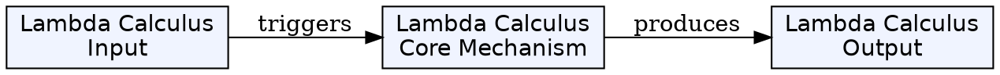
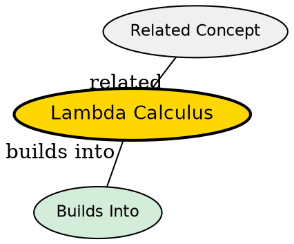

## The Problem

How can computation be expressed purely in terms of function abstraction and application?

## Core Idea

Lambda calculus is a formal system for expressing computation based on function abstraction and application. It is a foundational model of computation equivalent to Turing machines.

## How It Works

The system has three components:

- **Variables** (x, y, z...) - names for parameters
- **Abstraction** (λx.M) - defining functions
- **Application** (M N) - applying functions to arguments

Computation proceeds through **beta reduction** - replacing variables in the function body with arguments. Lambda calculus can encode all computable functions.

## Key Properties

- Formal model of computation based on functions
- Equivalent to Turing machines (Church-Turing thesis)
- Foundation for functional programming
- Uses beta reduction as the computation step
- Variables can be bound or free

## Visual Explanation

## Semantic Network

## Connections

- Built from: [[function-abstraction|Function Abstraction]], [[function-application|Function Application]]
- Builds into: [[computability-theory|Computability Theory]], [[functional-programming|Functional Programming]]
- Related: [[turing-machine|Turing Machine]], [[combinatory-logic|Combinatory Logic]]

## Edge Cases & Gotchas

- Lambda calculus has no native numbers or data structures--they must be encoded
- Some terms have no normal form (don't reduce to a final value)
## Why This Matters

Lambda calculus is the foundation for functional programming languages (Lisp, Haskell) and provides a pure mathematical model of computation based on functions rather than state machines.